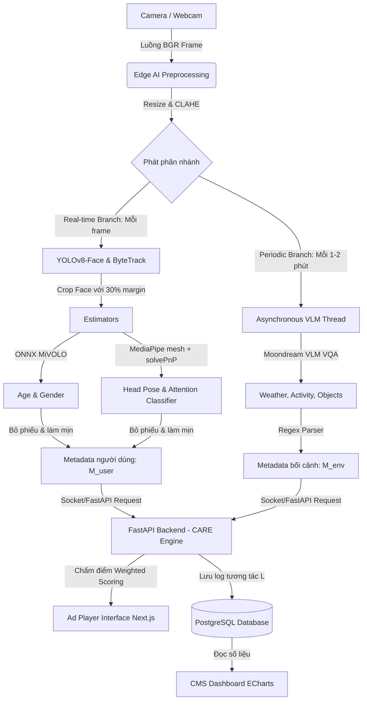

# Tracking-CV: Lõi Thị giác máy tính phân tích tương tác Standee quảng cáo thông minh

Mã nguồn xử lý lõi Thị giác máy tính (`CV Core Pipeline`) thuộc đồ án tốt nghiệp: *"Xây dựng hệ thống màn hình quảng cáo thông minh nhận biết ngữ cảnh và phân tích tương tác bằng Thị giác máy tính"*.

Dự án được thực hiện bởi nhóm sinh viên **Đặng Thái Bình** & **Lương Thế Tài**, dưới sự hướng dẫn của giảng viên **ThS. Cáp Phạm Đình Thăng** (UIT).

---

## I. System Architecture & Business Flow (Kiến trúc Hệ thống & Luồng Nghiệp vụ)

### 1. Sơ đồ Luồng Tổng Thể (System Architecture & Pipeline Chart)



### 2. Sơ đồ mô tả Input và Output bài toán (Input/Output Diagram)


### 3. Sơ đồ Quy trình xử lý chi tiết (Pipeline Flowchart)


### 4. Cơ cấu Cơ sở dữ liệu (Database Construction)

Cơ sở dữ liệu PostgreSQL lưu trữ dữ liệu log tương tác (`L = {timestamp, M_user, M_env, v*}`) phục vụ trực quan hóa lên CMS Dashboard:

```sql
-- Bảng lưu thông tin quảng cáo (Advertisements)
CREATE TABLE advertisements (
    id SERIAL PRIMARY KEY,
    title VARCHAR(255) NOT NULL,
    video_url VARCHAR(512) NOT NULL,
    target_gender VARCHAR(10),       -- M, F, hoặc ALL
    target_age_group VARCHAR(20),    -- 0-18, 18-35, 35-55, 55+
    target_context VARCHAR(100)[],   -- Các tag bối cảnh ví dụ: ['rainy', 'laptops']
    created_at TIMESTAMP DEFAULT CURRENT_TIMESTAMP
);

-- Bảng lưu log tương tác của khách hàng (User Interaction Logs)
CREATE TABLE interaction_logs (
    id SERIAL PRIMARY KEY,
    track_id INT NOT NULL,           -- Sinh ra từ ByteTrack để phân biệt khách hàng
    gender VARCHAR(10),              -- Giới tính nhận diện từ MiVOLO
    age_group VARCHAR(20),           -- Nhóm tuổi nhận diện từ MiVOLO
    yaw FLOAT,                       -- Góc xoay đầu ngang từ solvePnP
    pitch FLOAT,                     -- Góc xoay đầu dọc từ solvePnP
    attention INT DEFAULT 0,         -- 1: Có chú ý nhìn, 0: Không nhìn
    dwell_time FLOAT DEFAULT 0.0,    -- Thời gian nhìn lũy kế (giây)
    ad_played_id INT REFERENCES advertisements(id), -- Quảng cáo đã phát
    weather VARCHAR(50),             -- Bối cảnh thời tiết tại thời điểm t
    crowd_activity VARCHAR(100),     -- Hoạt động bối cảnh đám đông
    objects_detected TEXT,           -- Vật thể bối cảnh phát hiện (phân tách bằng '|')
    logged_at TIMESTAMP DEFAULT CURRENT_TIMESTAMP
);
```

### 5. Luồng Nghiệp vụ Chi tiết (Detailed Workflow)

1. **Camera Input**: Luồng camera liên tục ghi lại BGR frame.
2. **Preprocessing**: Ảnh được resize (cạnh dài 640px) để duy trì tốc độ và cân bằng sáng bằng bộ lọc **CLAHE** chống ngược sáng.
3. **Real-time Branch (Nhánh thời gian thực)**:
   * **YOLOv8-Face** phát hiện mặt, kết hợp thuật toán **ByteTrack** gán `track_id` ổn định.
   * Cắt rộng mặt 30% margin đưa qua **MiVOLO** nhận diện tuổi/giới tính. Lấy trung vị và bỏ phiếu bầu sau 7 mẫu đầu để khóa thuộc tính, chống giật đổi thông số.
   * Dùng **MediaPipe Face Mesh** trích xuất 6 điểm mốc chính, giải bài toán **PnP (Perspective-n-Point)** tìm góc quay đầu. Lọc làm mịn theo thời gian để tính `attention` và cộng dồn `dwell_time`.
4. **Periodic Branch (Nhánh bối cảnh nền)**:
   * Thread riêng chạy bất đồng bộ mỗi 90 giây gửi frame về **Moondream VLM** để chạy VQA câu hỏi đóng nhận biết bối cảnh.
5. **CARE Recommendation Engine & Interface**:
   * API Backend tiếp nhận metadata, tính toán điểm độ phù hợp của quảng cáo dựa trên demographics (tuổi, giới tính) và bối cảnh (thời tiết, hoạt động xung quanh).
   * Ad Player Next.js nhận video chỉ định và phát mượt mà qua cơ chế đệm kép (Double Buffering). Dữ liệu lưu vào database PostgreSQL.

---

## II. Hướng dẫn thiết lập & Chạy thử nghiệm (Setup & Run)

### 1. Cài đặt môi trường

Dự án được quản lý môi trường và thư viện tự động bằng công cụ **`uv`**:

```bash
# Đồng bộ môi trường và tải các thư viện real-time từ uv.lock
uv sync
```

*(Nếu muốn chạy nhánh VLM thật, hãy cài đặt các thư viện bổ sung qua: `uv pip install -r requirements-vlm.txt`)*

### 2. Tải và Thiết lập các File Trọng số (Model Weights Setup)

Để hệ thống hoạt động đầy đủ tính năng suy luận AI, bạn cần thiết lập các tệp tin trọng số mô hình trong thư mục `models/` (đã được cấu hình trong `configs.py` và được bỏ qua trong Git):

#### A. Trọng số YOLOv8-Face (`models/yolov8n-face.pt` - ~6MB)
* **Tự động:** Khi khởi chạy lần đầu qua các lệnh `run_webcam.py`, `run_video.py` hoặc `test_pipeline_dryrun.py`, hệ thống sẽ tự động phát hiện và tải file này từ Hugging Face về thư mục `models/` cho bạn.
* **Thủ công:** Bạn có thể tải trực tiếp từ link [Hugging Face YOLOv8-Face](https://huggingface.co/junjiang/GestureFace/resolve/main/yolov8n-face.pt) và đặt vào thư mục:
  `models/yolov8n-face.pt`

#### B. Trọng số MiVOLO ONNX (`models/mivolo_age_gender.onnx` - ~100MB)
Do tệp trọng số MiVOLO ONNX chính gốc không có liên kết tải trực tiếp chính thức và bị bỏ qua trong Git, bạn có hai cách tiếp cận:
* **Cách 1: Lấy file ONNX trực tiếp từ nhóm thiết kế** (Khuyên dùng). Sao chép tệp `mivolo_age_gender.onnx` do nhóm chuyển giao vào thư mục:
  `models/mivolo_age_gender.onnx`
* **Cách 2: Tự tạo file ONNX nội bộ (Surrogate ONNX model)**: Kích hoạt môi trường ảo và chạy lệnh sau để tự sinh một mô hình ONNX thay thế giúp pipeline chạy thật trên ONNX Runtime:
  ```bash
  # Tải thư viện hỗ trợ xuất ONNX
  uv pip install onnxscript
  
  # Chạy script tự động xuất ONNX mô phỏng
  uv run python -c "import urllib.request; urllib.request.urlretrieve('https://raw.githubusercontent.com/binhdang/UIT/main/generate_mivolo_onnx.py', 'generate_mivolo_onnx.py'); import subprocess; subprocess.run(['python', 'generate_mivolo_onnx.py'])"
  ```

#### C. Trọng số Moondream VLM (`vikhyat/moondream2` - ~1.6GB)
* **Tự động:** Khi bạn bật chế độ VLM (`vlm_enabled: bool = True` trong `configs.py`), luồng chạy nền sẽ tự động tải Moondream2 thông qua thư viện `transformers` của Hugging Face và lưu vào thư mục cache của hệ thống.
* **Yêu cầu:** Máy tính cần có kết nối mạng Internet ở lần khởi chạy đầu tiên. Thư viện sẽ tự động phân phối trọng số tối ưu (định dạng `float16` trên Apple Silicon/CUDA, `float32` trên CPU) với cờ `trust_remote_code=True`.

### 3. Chạy thử nghiệm Demo

* **Chạy nhận dạng camera/webcam trực tiếp hiển thị giao diện overlay:**
  ```bash
  uv run python run_webcam.py
  ```
* **Chạy phân tích video test có sẵn và xuất log ra CSV:**
  ```bash
  uv run python run_video.py --video data/test.mp4 --out outputs/test.csv
  ```

### 4. Chạy thực nghiệm lấy số liệu báo cáo đồ án

Chúng ta chạy các script đánh giá độc lập nằm trong thư mục `eval/`:

* **Đo tương phản và tỉ lệ phát hiện khuôn mặt ngược sáng có vs không có CLAHE:**
  ```bash
  uv run python eval/eval_clahe.py
  ```
* **Đo FPS chi tiết từng khâu để tối ưu tài nguyên phần cứng biên:**
  ```bash
  uv run python eval/eval_fps.py
  ```

---

## III. Ứng dụng Standee: FastAPI + Next.js + PostgreSQL

Lớp ứng dụng nằm trên lõi CV, gọi đúng **một** điểm nối `Pipeline.process(frame) -> list[PersonMeta]`.
Không có gì trong `pipeline.py` bị sửa để phục vụ app.

```
web/ (Next.js)                 server/ (FastAPI)                  lõi CV (không đổi)
 ├ /        bảng điều khiển  ─┐  ├ player.py   đồng hồ playlist    preprocess → FaceTracker
 ├ /ads     thư viện QC       ├─▶ engine.py   1 luồng camera  ────▶ crop → HeadPose → attention
 └ /player  màn hình chiếu   ─┘  ├ reports.py  reach / impression   → AgeGender
                                 └ db.py       PostgreSQL
```

> **Dự án chạy trên nền web.** Không có bản app desktop hay mobile — toàn bộ thao tác
> (tải quảng cáo, bật camera, xem số liệu, chiếu lên màn hình) đều nằm trong trình duyệt.
> `run_webcam.py` và `run_video.py` chỉ là **công cụ debug** pipeline bằng cửa sổ OpenCV,
> phục vụ đo đạc cho báo cáo, không thuộc luồng sản phẩm.

### 0. Chạy nhanh (một lệnh)

```bash
./run_web.sh
```

Script tự kiểm tra PostgreSQL, tạo database nếu chưa có, cài phụ thuộc lần đầu, ghi
`web/.env.local` cho đúng cổng rồi chạy song song API và dashboard. Ctrl-C tắt cả hai.

| Địa chỉ | Nội dung |
| :--- | :--- |
| <http://localhost:3000> | Bảng điều khiển — số liệu trực tiếp và báo cáo từng quảng cáo (chỉ xem) |
| <http://localhost:3000/ads> | Thư viện quảng cáo — tải ảnh/video lên, sắp thứ tự, đặt thời lượng |
| <http://localhost:3000/admin> | **Quản trị** — chọn nguồn camera, bật/tắt phân tích, điều khiển phát |
| <http://localhost:3000/player> | Màn hình chiếu — mở trên máy gắn với standee, nhấn `F` để toàn màn hình |
| <http://localhost:8000/docs> | Tài liệu API tự sinh |

### Hai chế độ camera

Chọn ở trang Quản trị. Hai chế độ **loại trừ nhau** — hai nguồn cùng đổ vào một
`Pipeline` sẽ trộn hai bối cảnh vào chung một tập track id và làm hỏng mọi số đo.

| | Trình duyệt (`getUserMedia`) | Máy chủ (OpenCV) |
| :--- | :--- | :--- |
| Camera nằm ở | máy đang mở `/player` | máy chạy FastAPI |
| Đường đi | JPEG qua `ws://…/ws/ingest` | `cv2.VideoCapture` trong tiến trình |
| Hợp khi | mỗi màn hình một camera, máy chủ đặt chỗ khác | standee và máy chủ là cùng một máy |
| Đánh đổi | tốn băng thông, ~12 fps | nhanh nhất, nhưng camera phải cắm đúng máy |

Ở chế độ trình duyệt, `/player` **tự bật camera** khi mở và tự khởi động phân tích —
người xem không thấy gì ngoài quảng cáo (thẻ video ẩn ở kích thước 1px). Nhấn `H`
để xem trạng thái camera, `F` để toàn màn hình.

> ⚠️ **Trình duyệt chỉ cho phép mở camera trên `localhost` hoặc HTTPS.** Mở
> `/player` bằng địa chỉ LAN kiểu `http://192.168.1.x:3000` sẽ *không* có camera —
> đó là quy định của trình duyệt, không phải lỗi cấu hình. Đặt HTTPS cho máy chủ,
> hoặc chạy trình duyệt ngay trên máy đó.

Mỗi lúc chỉ **một** màn hình được gửi camera lên. Màn hình thứ hai sẽ bị từ chối và
báo rõ trên HUD; nó tự thử lại nên khi màn hình đầu tắt thì nó tiếp quản. Trang
Quản trị hiển thị màn hình nào đang gửi, ở bao nhiêu fps.

Ba mục dưới đây là cách chạy từng phần thủ công, khi cần gỡ lỗi riêng lẻ.

### 1. Chuẩn bị PostgreSQL

```bash
docker compose up -d          # hoặc: brew services start postgresql@14 && createdb signage
export DATABASE_URL=postgresql://localhost:5432/signage
```

Bảng được tạo tự động lúc khởi động (`server/db.py`), không cần chạy migration.

### 2. Chạy backend

```bash
uv sync
uv run uvicorn server.main:app --reload --port 8000
```

Tài liệu API tự sinh tại <http://localhost:8000/docs>.

| Endpoint | Ý nghĩa |
| :--- | :--- |
| `GET/POST/PATCH/DELETE /api/ads` | Thư viện quảng cáo (upload ảnh/video, đổi tên, thời lượng, bật/tắt) |
| `PUT /api/ads/order` | Sắp xếp thứ tự chiếu |
| `POST /api/player/start\|stop\|skip` | Điều khiển playlist |
| `GET /api/player/now-playing` | Quảng cáo đang trên màn hình + thời gian còn lại |
| `POST /api/capture/start\|stop` | Bật/tắt camera (`"0"` = webcam, hoặc đường dẫn video) |
| `GET /api/capture/stream.mjpg` | Luồng MJPEG đã vẽ bbox/góc đầu/attention |
| `GET /api/analytics/live` | Ảnh chụp tức thời: đang có mặt, đang nhìn, danh sách track |
| `GET /api/analytics/summary` | Báo cáo theo từng quảng cáo |
| `GET /api/analytics/timeline` | Nhật ký từng lượt chiếu |
| `GET /api/analytics/export.csv` | Xuất toàn bộ impression ra CSV |
| `WS /ws/live` | Đẩy số liệu trực tiếp mỗi giây |

### 3. Chạy frontend

```bash
cd web
npm install
npm run dev            # http://localhost:3000
```

`web/.env.local` chỉ cần một biến: `NEXT_PUBLIC_API_BASE=http://localhost:8000`.

### 4. Cách đếm (quan trọng khi viết báo cáo)

Hệ thống tách bạch hai con số thường bị gộp làm một:

| Chỉ số | Định nghĩa |
| :--- | :--- |
| **Reach** (đi qua) | Số người có mặt trước màn hình >= `min_presence_seconds` (0.5s) trong lúc quảng cáo đang chiếu. Đây là footfall. |
| **Impression** (xem thực) | Tập con của reach, những người thật sự **nhìn** màn hình >= `min_attention_seconds` (1.0s), xác định bằng góc đầu yaw/pitch từ solvePnP. |
| **Attention rate** | `impression / reach` — chỉ số đáng tối ưu cho một mẫu quảng cáo. |
| **Dwell** | Tổng số giây người xem thực sự nhìn, cộng dồn theo từng quảng cáo. |

Một người đứng xem ba quảng cáo liên tiếp sinh ra **ba** impression (mỗi lượt chiếu một
dòng), nhưng nhìn đi nhìn lại trong cùng một lượt chiếu vẫn chỉ là **một** — ràng buộc
`UNIQUE (airing_id, track_id)` trong bảng `impressions` bảo đảm điều đó.

Backend giữ đồng hồ playlist, không phải trình duyệt. Nhờ vậy số liệu và nội dung trên
màn hình không bao giờ lệch nhau, kể cả khi tab bị tải lại hay mở nhiều màn hình.

### 5. Giới hạn cần nêu thẳng trong báo cáo

- Thiếu `models/mivolo_age_gender.onnx` thì cột **tuổi/giới tính để trống**, hệ thống
  không đoán bừa. Muốn có dữ liệu giả để thử giao diện, bật `CFG.allow_mock_attributes`
  — và phải nói rõ đó là dữ liệu giả.
- Nhánh VLM (`scene_vlm.py`) mặc định **tắt**; khi tắt, `SceneContext` rỗng chứ không
  báo "sunny".
- Attention dựa trên head pose (hướng đầu), không phải gaze (hướng mắt). Người quay mặt
  về màn hình nhưng liếc chỗ khác vẫn bị tính là đang nhìn.
- Với khuôn mặt nhỏ hơn `CFG.min_face_px_for_pose` (16px), MediaPipe Face Mesh không
  chạy nên attention của track đó là 0 — cần đặt camera đủ gần.
