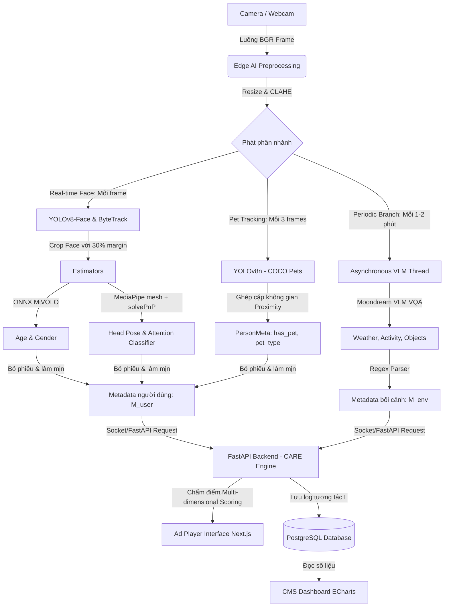

# Tracking-CV: Lõi Thị giác máy tính phân tích tương tác Standee quảng cáo thông minh

Mã nguồn xử lý lõi Thị giác máy tính (`CV Core Pipeline`) thuộc đồ án tốt nghiệp: *"Xây dựng hệ thống màn hình quảng cáo thông minh nhận biết ngữ cảnh và phân tích tương tác bằng Thị giác máy tính"*.

Dự án được thực hiện bởi nhóm sinh viên **Đặng Thái Bình** & **Lương Thế Tài**, dưới sự hướng dẫn của giảng viên **ThS. Cáp Phạm Đình Thăng** (UIT).

---

## I. System Architecture & Business Flow (Kiến trúc Hệ thống & Luồng Nghiệp vụ)

### 1. Sơ đồ Luồng Tổng Thể (System Architecture & Pipeline Chart)



### 2. Sơ đồ mô tả Input và Output bài toán (Input/Output Diagram)


### 3. Sơ đồ Quy trình xử lý chi tiết (Pipeline Flowchart)


### 4. Cơ cấu Cơ sở dữ liệu (Database Construction)

Cơ sở dữ liệu PostgreSQL lưu trữ dữ liệu log tương tác (`L = {timestamp, M_user, M_env, v*}`), cấu hình chiến dịch quảng cáo và phiên phân tích camera:

```sql
-- 1. Bảng lưu thông tin quảng cáo (Creatives)
CREATE TABLE creatives (
    id SERIAL PRIMARY KEY,
    name TEXT NOT NULL,
    filename TEXT NOT NULL,
    kind TEXT NOT NULL CHECK (kind IN ('image', 'video')),
    duration DOUBLE PRECISION NOT NULL DEFAULT 15.0,
    position INTEGER NOT NULL DEFAULT 0,
    enabled BOOLEAN NOT NULL DEFAULT TRUE,
    created_at DOUBLE PRECISION NOT NULL,
    target_age_group TEXT DEFAULT 'all',  -- '<18', '19-35', '36-50', '>55', 'all'
    target_gender TEXT DEFAULT 'all',     -- 'M', 'F', 'all'
    target_crowd TEXT DEFAULT 'all',      -- 'single', 'group', 'crowd', 'all'
    target_weather TEXT DEFAULT 'all',    -- 'sunny', 'rainy', 'cloudy', 'all'
    target_pet TEXT DEFAULT 'all',        -- 'dog', 'cat', 'yes', 'none', 'all'
    target_clothing TEXT DEFAULT 'all',   -- 'black', 'white', 'blue', 'red', 'all'
    target_style TEXT DEFAULT 'all',      -- 'Formal', 'Sport', 'Casual', 'all'
    category TEXT DEFAULT 'Chung',        -- 'Thực phẩm & Đồ uống', 'Thời trang & Làm đẹp', 'Công nghệ & Gaming'
    description TEXT DEFAULT ''
);

-- 2. Bảng lưu từng lượt phát sóng quảng cáo (Airings)
CREATE TABLE airings (
    id SERIAL PRIMARY KEY,
    creative_id INTEGER NOT NULL REFERENCES creatives(id) ON DELETE CASCADE,
    started_at DOUBLE PRECISION NOT NULL,
    ended_at DOUBLE PRECISION
);

-- 3. Bảng lưu log tương tác chi tiết từng người xem (Impressions)
CREATE TABLE impressions (
    id SERIAL PRIMARY KEY,
    airing_id INTEGER NOT NULL REFERENCES airings(id) ON DELETE CASCADE,
    creative_id INTEGER NOT NULL REFERENCES creatives(id) ON DELETE CASCADE,
    track_id INTEGER NOT NULL,
    first_seen DOUBLE PRECISION NOT NULL,
    last_seen DOUBLE PRECISION NOT NULL,
    presence_seconds DOUBLE PRECISION NOT NULL,
    attention_seconds DOUBLE PRECISION NOT NULL,
    age_group TEXT,
    gender TEXT,
    has_pet BOOLEAN DEFAULT FALSE,        -- Khách hàng có dắt theo thú cưng
    pet_type TEXT,                        -- 'dog' hoặc 'cat'
    clothing_color TEXT,                  -- Màu áo chủ đạo
    clothing_style TEXT,                  -- Phong cách: 'Formal', 'Sport', 'Casual'
    UNIQUE (airing_id, track_id)
);

-- 4. Bảng lưu lịch sử phiên chạy camera (Tracking Sessions)
CREATE TABLE tracking_sessions (
    id SERIAL PRIMARY KEY,
    session_code TEXT UNIQUE NOT NULL,
    device_id TEXT NOT NULL DEFAULT 'host',
    screen_id INTEGER REFERENCES screens(id),
    source TEXT NOT NULL,
    started_at DOUBLE PRECISION NOT NULL,
    ended_at DOUBLE PRECISION,
    status TEXT NOT NULL DEFAULT 'active',
    total_footfall INTEGER DEFAULT 0,
    total_impressions INTEGER DEFAULT 0,
    attention_rate DOUBLE PRECISION DEFAULT 0.0,
    avg_dwell_time DOUBLE PRECISION DEFAULT 0.0,
    peak_people INTEGER DEFAULT 0,
    notes TEXT NOT NULL DEFAULT '',
    demographics_json TEXT NOT NULL DEFAULT '{}',
    tracks_json TEXT NOT NULL DEFAULT '[]' -- Chi tiết từng người: tuổi, giới tính, pet, màu áo, style, dwell
);
```

### 5. Luồng Nghiệp vụ Chi tiết (Detailed Workflow)

1. **Camera Input**: Luồng camera liên tục ghi lại BGR frame.
2. **Preprocessing**: Ảnh được resize (cạnh dài 640px) để duy trì tốc độ và cân bằng sáng bằng bộ lọc **CLAHE** chống ngược sáng.
3. **Real-time Face Branch (Nhánh khuôn mặt thời gian thực)**:
   * **YOLOv8-Face** phát hiện mặt, kết hợp thuật toán **ByteTrack** gán `track_id` ổn định.
   * Cắt rộng mặt 30% margin đưa qua **MiVOLO v2 ONNX** nhận diện tuổi/giới tính. Lấy trung vị và bỏ phiếu bầu sau 7 mẫu đầu để khóa thuộc tính, chống giật đổi thông số.
   * Dùng **MediaPipe Face Mesh** trích xuất 6 điểm mốc chính, giải bài toán **PnP (Perspective-n-Point)** tìm góc quay đầu. Lọc làm mịn theo thời gian để tính `attention` và cộng dồn `dwell_time`.
4. **Pet Tracking Branch (Nhánh theo vết Thú cưng)**:
   * **YOLOv8n** quét tìm chó (`dog`) và mèo (`cat`) mỗi 3 frame (tiết kiệm tài nguyên).
   * Thuật toán **Spatial Proximity Matching** tính khoảng cách giữa tâm thú cưng và vị trí đứng của người gần nhất để gán quyền sở hữu (`has_pet = True`, `pet_type = 'dog'|'cat'`).
5. **Clothing & Style Branch (Nhánh Trang phục & Phong cách Siêu nhẹ)**:
   * Cắt vùng thân trên (Upper-body torso) ngay dưới mặt, áp dụng **K-Means ($k=3$)** trích xuất màu áo chủ đạo ($< 0.5\text{ ms}$, $0\text{ MB}$).
   * Phân loại phong cách (*Formal / Sport / Casual*) qua phân bố màu sắc theo cơ chế **One-shot per Track**, lưu cache bảo toàn 30 FPS.
6. **Periodic Branch & Taxonomy Binding (Nhánh bối cảnh nền VLM)**:
   * Thread riêng chạy bất đồng bộ mỗi 30–90 giây gửi frame về **Moondream2 VLM** để chạy VQA câu hỏi đóng nhận biết thời tiết và vật thể ngoại cảnh (đồ ăn, túi shopping, laptop).
   * Dropdown Thể loại ngành hàng trên giao diện `/ads` liên kết trực tiếp với các nhãn vật thể VLM để cộng thưởng $+10.0$ điểm khi phát hiện bối cảnh khớp.
7. **CARE Recommendation Engine**:
   * Chấm điểm đa chiều dựa trên demographics (tuổi, giới tính), thú cưng (`+40.0` điểm cho pet ad), trang phục/phong cách (+15.0 điểm) và bối cảnh (thời tiết $+20.0$, vật thể $+10.0$).
8. **Dynamic Cut-in & Lookahead Window (Cơ chế ngắt thông minh & Cửa sổ tính toán trước)**:
   * **Dynamic Cut-in**: Khi phát hiện mục tiêu khẩn cấp giá trị cao (khách dắt thú cưng hoặc match score $\ge 80\%$), nếu quảng cáo hiện tại đã phát tối thiểu $T_{\text{min}}$ (3.0s), player lập tức ngắt sớm để mở ngay clip thích ứng.
   * **Lookahead Pre-decision Window**: Trong $N$ giây cuối trước khi video kết thúc (3.0s), player đánh giá khán giả và khóa trước clip tiếp theo, loại trừ độ trễ chuyển cảnh (0s latency).
   * Hỗ trợ cài đặt tham số linh hoạt trực tiếp trên giao diện Admin qua nút **"⚙️ Cài đặt"**.
9. **Fair Ad Rotation via Least Recently Played (LRP)**:
   * Khi không có khán giả trước màn hình, hệ thống xoay vòng theo thuật toán LRP: video có thời gian phát xa nhất trong quá khứ (hoặc chưa từng phát) được ưu tiên chiếu trước, video vừa chiếu xong bị loại trừ ngay, triệt tiêu việc lặp đi lặp lại các video 1, 2, 3 đầu danh mục.
10. **Ad Player Interface & Session Ledger**:
   * Ad Player Next.js nhận video chỉ định và phát mượt mà qua cơ chế đệm kép (Double Buffering).
   * Lịch sử phiên ghi nhận chi tiết danh sách người xem kèm thuộc tính thú cưng, màu áo, style, hỗ trợ xem trực quan và xuất CSV 16 cột.

---

## II. Hướng dẫn thiết lập & Chạy thử nghiệm (Setup & Run)

### 1. Cài đặt môi trường

Dự án được quản lý môi trường và thư viện tự động bằng công cụ **`uv`**:

```bash
# Đồng bộ môi trường và tải các thư viện real-time từ uv.lock
uv sync
```

*(Nếu muốn chạy nhánh VLM thật, hãy cài đặt các thư viện bổ sung qua: `uv pip install -r requirements-vlm.txt`)*

### 2. Tải và Thiết lập các File Trọng số (Model Weights Setup)

Hệ thống cung cấp script **chuẩn bị tự động toàn bộ mô hình chỉ với 1 câu lệnh**:

```bash
# Chuẩn bị và kiểm tra toàn bộ YOLOv8-Face, YOLOv8n Pets, MiVOLO v2 ONNX và Video Ads:
uv run python prepare_models.py

# (Tùy chọn) Bỏ qua tải trước 1.6 GB Moondream2 VLM nếu chỉ chạy camera thời gian thực:
uv run python prepare_models.py --skip-vlm
```

Nếu muốn thiết lập thủ công từng mô hình, bạn xem hướng dẫn chi tiết tại [**DOWNLOAD_MODELS.md**](DOWNLOAD_MODELS.md):
*   **YOLOv8-Face (`models/yolov8n-face.pt` - ~6.1MB):** Tự động tải từ Hugging Face khi khởi chạy lần đầu hoặc qua `prepare_models.py`.
*   **YOLOv8n Pets (`models/yolov8n.pt` - ~6.2MB):** Tự động tải qua `prepare_models.py` phục vụ nhận diện chó & mèo.
*   **MiVOLO v2 ONNX (`models/mivolo_age_gender.onnx` + `.data` - ~112.5MB):** Tự động tải từ Hugging Face Hub và xuất sang chuẩn ONNX khi chạy `prepare_models.py`.
*   **Moondream2 VLM (`vikhyatk/moondream2` - ~1.6GB):** Tải tự động vào cache Hugging Face khi chuẩn bị với `prepare_models.py` (không dùng cờ `--skip-vlm`).


### 3. Chạy thử nghiệm Demo

* **Chạy nhận dạng camera/webcam trực tiếp hiển thị giao diện overlay:**
  ```bash
  uv run python run_webcam.py
  ```
* **Chạy phân tích video test có sẵn và xuất log ra CSV:**
  ```bash
  uv run python run_video.py --video data/test.mp4 --out outputs/test.csv
  ```

### 4. Chạy thực nghiệm lấy số liệu báo cáo đồ án

Chúng ta chạy các script đánh giá độc lập nằm trong thư mục `eval/`:

* **Đo tương phản và tỉ lệ phát hiện khuôn mặt ngược sáng có vs không có CLAHE:**
  ```bash
  uv run python eval/eval_clahe.py
  ```
* **Đo FPS chi tiết từng khâu để tối ưu tài nguyên phần cứng biên:**
  ```bash
  uv run python eval/eval_fps.py
  ```

---

## III. Ứng dụng Standee: FastAPI + Next.js + PostgreSQL

Lớp ứng dụng nằm trên lõi CV, gọi đúng **một** điểm nối `Pipeline.process(frame) -> list[PersonMeta]`.
Không có gì trong `pipeline.py` bị sửa để phục vụ app.

```
web/ (Next.js)                 server/ (FastAPI)                  lõi CV (không đổi)
 ├ /        bảng điều khiển  ─┐  ├ player.py   đồng hồ playlist    preprocess → FaceTracker
 ├ /ads     thư viện QC       ├─▶ engine.py   1 luồng camera  ────▶ crop → HeadPose → attention
 └ /player  màn hình chiếu   ─┘  ├ reports.py  reach / impression   → AgeGender
                                 └ db.py       PostgreSQL
```

> **Dự án chạy trên nền web.** Không có bản app desktop hay mobile — toàn bộ thao tác
> (tải quảng cáo, bật camera, xem số liệu, chiếu lên màn hình) đều nằm trong trình duyệt.
> `run_webcam.py` và `run_video.py` chỉ là **công cụ debug** pipeline bằng cửa sổ OpenCV,
> phục vụ đo đạc cho báo cáo, không thuộc luồng sản phẩm.

### 0. Chạy nhanh (một lệnh)

```bash
./run_web.sh
```

Script tự kiểm tra PostgreSQL, tạo database nếu chưa có, cài phụ thuộc lần đầu, ghi
`web/.env.local` cho đúng cổng rồi chạy song song API và dashboard. Ctrl-C tắt cả hai.

| Địa chỉ | Nội dung |
| :--- | :--- |
| <http://localhost:3000> | Bảng điều khiển — số liệu trực tiếp và báo cáo từng quảng cáo (chỉ xem) |
| <http://localhost:3000/ads> | Thư viện quảng cáo — tải ảnh/video lên, sắp thứ tự, đặt thời lượng |
| <http://localhost:3000/admin> | **Quản trị** — chọn nguồn camera, bật/tắt phân tích, điều khiển phát |
| <http://localhost:3000/player> | Màn hình chiếu — mở trên máy gắn với standee, nhấn `F` để toàn màn hình |
| <http://localhost:8000/docs> | Tài liệu API tự sinh |

### Hai chế độ camera

Chọn ở trang Quản trị. Hai chế độ **loại trừ nhau** — hai nguồn cùng đổ vào một
`Pipeline` sẽ trộn hai bối cảnh vào chung một tập track id và làm hỏng mọi số đo.

| | Trình duyệt (`getUserMedia`) | Máy chủ (OpenCV) |
| :--- | :--- | :--- |
| Camera nằm ở | máy đang mở `/player` | máy chạy FastAPI |
| Đường đi | JPEG qua `ws://…/ws/ingest` | `cv2.VideoCapture` trong tiến trình |
| Hợp khi | mỗi màn hình một camera, máy chủ đặt chỗ khác | standee và máy chủ là cùng một máy |
| Đánh đổi | tốn băng thông, ~12 fps | nhanh nhất, nhưng camera phải cắm đúng máy |

Ở chế độ trình duyệt, `/player` **tự bật camera** khi mở và tự khởi động phân tích —
người xem không thấy gì ngoài quảng cáo (thẻ video ẩn ở kích thước 1px). Nhấn `H`
để xem trạng thái camera, `F` để toàn màn hình.

> ⚠️ **Trình duyệt chỉ cho phép mở camera trên `localhost` hoặc HTTPS.** Mở
> `/player` bằng địa chỉ LAN kiểu `http://192.168.1.x:3000` sẽ *không* có camera —
> đó là quy định của trình duyệt, không phải lỗi cấu hình. Đặt HTTPS cho máy chủ,
> hoặc chạy trình duyệt ngay trên máy đó.

Mỗi lúc chỉ **một** màn hình được gửi camera lên. Màn hình thứ hai sẽ bị từ chối và
báo rõ trên HUD; nó tự thử lại nên khi màn hình đầu tắt thì nó tiếp quản. Trang
Quản trị hiển thị màn hình nào đang gửi, ở bao nhiêu fps.

Ba mục dưới đây là cách chạy từng phần thủ công, khi cần gỡ lỗi riêng lẻ.

### 1. Chuẩn bị PostgreSQL

```bash
docker compose up -d          # hoặc: brew services start postgresql@14 && createdb signage
export DATABASE_URL=postgresql://localhost:5432/signage
```

Bảng được tạo tự động lúc khởi động (`server/db.py`), không cần chạy migration.

### 2. Chạy backend

```bash
uv sync
uv run uvicorn server.main:app --reload --port 8000
```

Tài liệu API tự sinh tại <http://localhost:8000/docs>.

| Endpoint | Ý nghĩa |
| :--- | :--- |
| `GET/POST/PATCH/DELETE /api/ads` | Thư viện quảng cáo (upload ảnh/video, đổi tên, thời lượng, phân khúc target, bật/tắt) |
| `PUT /api/ads/order` | Sắp xếp thứ tự chiếu |
| `GET/POST /api/ads/targeting-settings` | Cấu hình tham số Dynamic Cut-in & Lookahead Pre-decision Window |
| `POST /api/player/start\|stop\|skip` | Điều khiển playlist (bật, dừng, bỏ qua clip) |
| `GET /api/player/now-playing` | Quảng cáo đang trên màn hình + thời gian còn lại |
| `POST /api/capture/start\|stop` | Bật/tắt camera (`"0"` = webcam, hoặc đường dẫn video) |
| `GET /api/capture/sources` | Danh sách webcam và video test mô phỏng khả dụng |
| `POST /api/capture/upload-test-video` | Tải video test mới lên thư mục `inputs/` |
| `GET /api/capture/stream.mjpg` | Luồng MJPEG đã vẽ bbox/góc đầu/attention/pet vector |
| `GET /api/sessions` | Lịch sử danh sách các phiên chạy tracking camera |
| `GET /api/sessions/{id}` | Chi tiết phiên & mảng `tracks` (tuổi, giới tính, thú cưng, màu áo, style) |
| `GET /api/sessions/{id}/tracks/export.csv` | Xuất toàn bộ dữ liệu người xem trong phiên ra file CSV 16 cột |
| `GET /api/analytics/live` | Ảnh chụp tức thời: đang có mặt, đang nhìn, danh sách track trực tiếp |
| `GET /api/analytics/summary` | Báo cáo hiệu suất theo từng quảng cáo |
| `GET /api/analytics/timeline` | Nhật ký từng lượt chiếu quảng cáo (`airings`) |
| `GET /api/analytics/export.csv` | Xuất toàn bộ impressions ra CSV |
| `WS /ws/live` | Đẩy số liệu trực tiếp mỗi giây |

### 3. Chạy frontend

```bash
cd web
npm install
npm run dev            # http://localhost:3000
```

`web/.env.local` chỉ cần một biến: `NEXT_PUBLIC_API_BASE=http://localhost:8000`.

### 4. Cách đếm (quan trọng khi viết báo cáo)

Hệ thống tách bạch hai con số thường bị gộp làm một:

| Chỉ số | Định nghĩa |
| :--- | :--- |
| **Reach** (đi qua) | Số người có mặt trước màn hình >= `min_presence_seconds` (0.5s) trong lúc quảng cáo đang chiếu. Đây là footfall. |
| **Impression** (xem thực) | Tập con của reach, những người thật sự **nhìn** màn hình >= `min_attention_seconds` (1.0s), xác định bằng góc đầu yaw/pitch từ solvePnP. |
| **Attention rate** | `impression / reach` — chỉ số đáng tối ưu cho một mẫu quảng cáo. |
| **Dwell** | Tổng số giây người xem thực sự nhìn, cộng dồn theo từng quảng cáo. |

Một người đứng xem ba quảng cáo liên tiếp sinh ra **ba** impression (mỗi lượt chiếu một
dòng), nhưng nhìn đi nhìn lại trong cùng một lượt chiếu vẫn chỉ là **một** — ràng buộc
`UNIQUE (airing_id, track_id)` trong bảng `impressions` bảo đảm điều đó.

Backend giữ đồng hồ playlist, không phải trình duyệt. Nhờ vậy số liệu và nội dung trên
màn hình không bao giờ lệch nhau, kể cả khi tab bị tải lại hay mở nhiều màn hình.

### 5. Giới hạn cần nêu thẳng trong báo cáo

- Thiếu `models/mivolo_age_gender.onnx` thì cột **tuổi/giới tính để trống**, hệ thống
  không đoán bừa. Muốn có dữ liệu giả để thử giao diện, bật `CFG.allow_mock_attributes`
  — và phải nói rõ đó là dữ liệu giả.
- Nhánh VLM (`scene_vlm.py`) mặc định **tắt**; khi tắt, `SceneContext` rỗng chứ không
  báo "sunny".
- Attention dựa trên head pose (hướng đầu), không phải gaze (hướng mắt). Người quay mặt
  về màn hình nhưng liếc chỗ khác vẫn bị tính là đang nhìn.
- Với khuôn mặt nhỏ hơn `CFG.min_face_px_for_pose` (16px), MediaPipe Face Mesh không
  chạy nên attention của track đó là 0 — cần đặt camera đủ gần.
