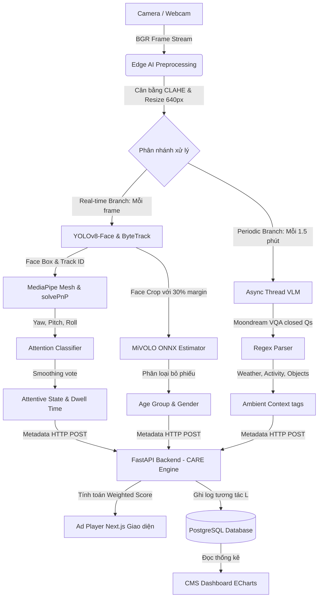

# System Architecture & Business Flow (Kiến trúc Hệ thống & Luồng Nghiệp vụ)

Tài liệu này mô tả chi tiết kiến trúc kỹ thuật, cấu trúc cơ sở dữ liệu và luồng xử lý chức năng của lõi Thị giác máy tính kết hợp hệ gợi ý quảng cáo Standee thông minh.

---

## 1. Pipeline Chart Luồng Tổng Thể



### Sơ đồ Sơ đồ I/O học thuật:


### Sơ đồ Sơ đồ Pipeline chi tiết:


---

## 2. Database Construct (Cấu trúc Cơ sở dữ liệu)

Hệ thống sử dụng cơ sở dữ liệu quan hệ PostgreSQL để lưu trữ cấu hình quảng cáo và ghi nhận logs tương tác thời gian thực phục vụ báo cáo.

```sql
-- 1. Bảng lưu trữ cấu hình chiến dịch quảng cáo (Advertisements)
CREATE TABLE advertisements (
    id SERIAL PRIMARY KEY,
    title VARCHAR(255) NOT NULL,              -- Tiêu đề quảng cáo
    video_url VARCHAR(512) NOT NULL,          -- Đường dẫn file video quảng cáo
    target_gender VARCHAR(10) DEFAULT 'ALL',  -- Đối tượng hướng tới: 'M', 'F', 'ALL'
    target_age_group VARCHAR(20),             -- Nhóm tuổi hướng tới: '0-18', '18-35', '35-55', '55+'
    target_context VARCHAR(100)[],            -- Các tag ngữ cảnh bối cảnh: e.g. {'rainy', 'laptops'}
    created_at TIMESTAMP DEFAULT CURRENT_TIMESTAMP
);

-- 2. Bảng lưu log tương tác chi tiết của khách hàng (User Interaction Logs)
CREATE TABLE interaction_logs (
    id SERIAL PRIMARY KEY,
    track_id INT NOT NULL,                    -- Định danh người xem sinh từ ByteTrack
    gender VARCHAR(10),                       -- Giới tính (M / F) nhận diện từ MiVOLO
    age_group VARCHAR(20),                    -- Nhóm tuổi (0-18, 18-35...)
    yaw FLOAT,                                -- Góc quay đầu ngang (trái - phải)
    pitch FLOAT,                              -- Góc quay đầu dọc (lên - xuống)
    attention INT DEFAULT 0,                  -- Trạng thái chú ý nhìn màn hình (1: Nhìn, 0: Không)
    dwell_time FLOAT DEFAULT 0.0,             -- Thời gian nhìn lũy kế của phiên (giây)
    ad_played_id INT REFERENCES advertisements(id), -- ID quảng cáo tương ứng đã phát
    weather VARCHAR(50),                      -- Bối cảnh thời tiết tại thời điểm t
    crowd_activity VARCHAR(100),              -- Hoạt động đám đông bối cảnh
    objects_detected TEXT,                    -- Vật thể bối cảnh phát hiện (chia tách bằng '|')
    logged_at TIMESTAMP DEFAULT CURRENT_TIMESTAMP
);
```

---

## 3. Workflow các Chức năng (Functional Workflows)

### 3.1 Nhánh Real-time Customer Interaction (Tương tác khách hàng thời gian thực)
* **Khâu Tiền xử lý (Preprocessing)**: Khung hình gốc được chuyển màu BGR sang LAB. Thuật toán **CLAHE** cân bằng sáng kênh L để loại bỏ nhiễu ngược sáng, sau đó resize ảnh về kích thước cạnh dài 640px để cấp cho bộ phát hiện.
* **Khâu Phát hiện & Theo vết (Detection & Tracking)**:
  * Mô hình **YOLOv8-face** quét ảnh tìm tọa độ bounding box khuôn mặt.
  * Bộ **ByteTrack** sử dụng thông số IoU kết hợp bộ lọc Kalman để theo dõi và duy trì định danh `track_id` duy nhất xuyên suốt thời gian khách hàng đứng trước standee.
* **Khâu Phân tích nhân khẩu học (Demographics)**:
  * Vùng mặt phát hiện được nới rộng 30% margin để tương thích với trường nhận diện của **MiVOLO** (ONNX).
  * Bộ phân tích sử dụng hàng đợi bỏ phiếu tích lũy (7 mẫu) và lấy **Median** cho tuổi, **Majority Voting** cho giới tính giúp khóa ổn định thuộc tính của người xem, tránh lỗi thay đổi thông số liên tục giữa các frame.
* **Khâu Phân tích chú ý & dwell_time (Attention & Dwell)**:
  * Mô hình **MediaPipe Face Mesh** trích xuất 6 tọa độ landmarks khuôn mặt 2D.
  * Thuật toán **PnP (Perspective-n-Point)** so sánh với mô hình mặt 3D chuẩn bằng `cv2.solvePnP` để giải ra ma trận góc quay Euler đầu (`yaw`, `pitch`, `roll`).
  * Trạng thái nhìn (`attention = 1`) được quyết định nếu $|yaw| < 22^\circ$ và $|pitch| < 17^\circ$. Lọc làm mịn thời gian giúp tính toán chính xác dwell time của phiên nhìn.

### 3.2 Nhánh Periodic Ambient Context (Phân tích bối cảnh môi trường định kỳ)
* Một **Thread riêng** được khởi động song song để không block luồng xử lý camera real-time.
* Định kỳ mỗi 90 giây, Thread chụp frame camera gửi cho **Moondream VLM**.
* Sử dụng cơ chế câu hỏi VQA đóng để trích xuất bối cảnh ("Is it raining?", "Are people walking?"). Kết quả trả về được lưu trữ trong một biến chia sẻ dùng chung được bảo vệ bởi khóa `threading.Lock`.

### 3.3 Bộ gợi ý CARE Engine (Context-Aware Recommendation Engine)
* Khi luồng chính cập nhật metadata người dùng cận cảnh và bối cảnh môi trường, CARE Engine tại Backend FastAPI tính toán điểm số cho từng video quảng cáo $v_i$:
  $$\text{Score}(v_i) = w_1 \cdot \text{Sim}(\text{gender}_i, \text{gender}) + w_2 \cdot \text{Sim}(\text{age\_group}_i, \text{age\_group}) + w_3 \cdot \text{Sim}(\text{context}_i, M_{env})$$
* **Cơ chế trọng số động**:
  * Nếu `attention = 1` (khách hàng đang nhìn thẳng): trọng số demographics $w_1, w_2$ đóng vai trò chủ đạo để tối ưu cá nhân hóa.
  * Nếu `attention = 0` (không có ai tương tác trực diện): trọng số ngữ cảnh bối cảnh $w_3$ (thời tiết, hoạt động đám đông) đóng vai trò chủ đạo để phát nội dung thu hút đám đông từ xa.
* Giao diện **Next.js Ad Player** nhận chỉ thị quảng cáo qua WebSockets hoặc HTTP API, chạy song song 2 thẻ video đè lên nhau sử dụng kỹ thuật **Đệm kép (Double Buffering)** để triệt tiêu hoàn toàn màn hình đen 1-2 giây khi chuyển đổi quảng cáo.
