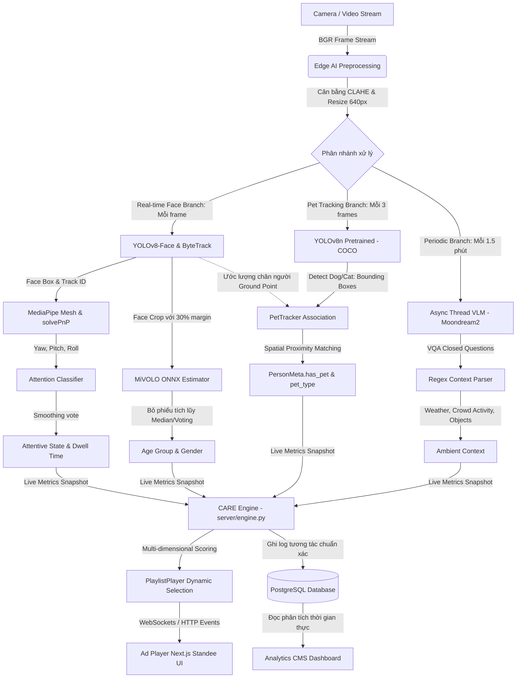
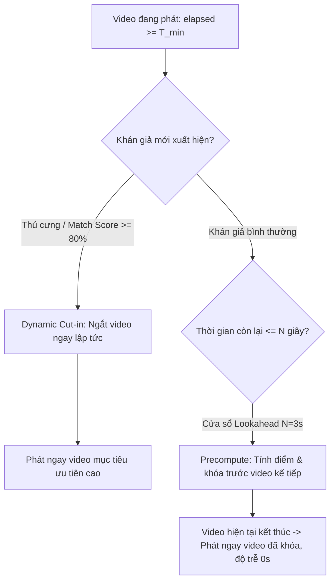
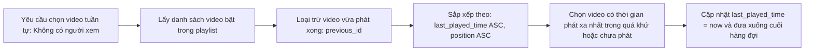
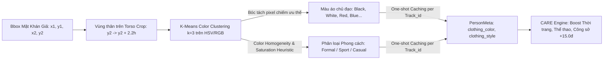

# System Architecture & Business Flow (Kiến trúc Hệ thống & Luồng Nghiệp vụ)

Tài liệu này mô tả chi tiết kiến trúc kỹ thuật, cấu trúc cơ sở dữ liệu và luồng xử lý chức năng của lõi Thị giác máy tính kết hợp hệ gợi ý quảng cáo Standee thông minh.

---

## 1. Pipeline Chart Luồng Tổng Thể



### Sơ đồ I/O học thuật:


### Sơ đồ Pipeline chi tiết:


---

## 2. Database Construct (Cấu trúc Cơ sở dữ liệu)

Hệ thống sử dụng cơ sở dữ liệu quan hệ PostgreSQL (quản lý kết nối qua connection pool `psycopg_pool`) để lưu trữ cấu hình chiến dịch quảng cáo (`creatives`), lượt chiếu (`airings`), nhật ký tương tác người xem (`impressions`), thiết bị standee (`screens`), danh sách phát (`playlists`, `playlist_items`), người dùng quản trị (`users`), phiên theo dõi camera (`tracking_sessions`), và trạng thái ứng dụng (`app_state`).

```sql
-- 1. Bảng lưu trữ cấu hình nội dung quảng cáo (Creatives)
CREATE TABLE IF NOT EXISTS creatives (
    id                SERIAL PRIMARY KEY,
    name              TEXT             NOT NULL,
    filename          TEXT             NOT NULL,
    kind              TEXT             NOT NULL CHECK (kind IN ('image', 'video')),
    duration          DOUBLE PRECISION NOT NULL DEFAULT 15.0,
    position          INTEGER          NOT NULL DEFAULT 0,
    enabled           BOOLEAN          NOT NULL DEFAULT TRUE,
    created_at        DOUBLE PRECISION NOT NULL,
    target_age_group  TEXT             NOT NULL DEFAULT 'all',  -- '<18', '19-35', '36-50', '>55', 'all'
    target_gender     TEXT             NOT NULL DEFAULT 'all',  -- 'M', 'F', 'all'
    target_crowd      TEXT             NOT NULL DEFAULT 'all',  -- 'single', 'group', 'crowd', 'all'
    target_weather    TEXT             NOT NULL DEFAULT 'all',  -- 'sunny', 'rainy', 'cloudy', 'all'
    target_pet        TEXT             NOT NULL DEFAULT 'all',  -- 'dog', 'cat', 'yes', 'none', 'all'
    target_clothing   TEXT             NOT NULL DEFAULT 'all',  -- 'black', 'white', 'blue', 'red', 'all'
    target_style      TEXT             NOT NULL DEFAULT 'all',  -- 'Formal', 'Sport', 'Casual', 'all'
    category          TEXT             NOT NULL DEFAULT 'Chung', -- 'Thực phẩm & Đồ uống', 'Thời trang & Làm đẹp', 'Công nghệ & Gaming', ...
    description       TEXT             NOT NULL DEFAULT ''
);

-- 2. Bảng lưu từng lượt phát sóng quảng cáo liên tục (Airings)
CREATE TABLE IF NOT EXISTS airings (
    id          SERIAL PRIMARY KEY,
    creative_id INTEGER          NOT NULL REFERENCES creatives(id) ON DELETE CASCADE,
    started_at  DOUBLE PRECISION NOT NULL,
    ended_at    DOUBLE PRECISION
);
CREATE INDEX IF NOT EXISTS idx_airings_creative ON airings(creative_id);
CREATE INDEX IF NOT EXISTS idx_airings_started ON airings(started_at DESC);

-- 3. Bảng lưu log tương tác chi tiết từng người xem ứng với mỗi lượt chiếu (Impressions)
CREATE TABLE IF NOT EXISTS impressions (
    id                SERIAL PRIMARY KEY,
    airing_id         INTEGER          NOT NULL REFERENCES airings(id) ON DELETE CASCADE,
    creative_id       INTEGER          NOT NULL REFERENCES creatives(id) ON DELETE CASCADE,
    track_id          INTEGER          NOT NULL,
    first_seen        DOUBLE PRECISION NOT NULL,
    last_seen         DOUBLE PRECISION NOT NULL,
    presence_seconds  DOUBLE PRECISION NOT NULL,
    attention_seconds DOUBLE PRECISION NOT NULL,
    age_group         TEXT,
    gender            TEXT,
    has_pet           BOOLEAN          DEFAULT FALSE,        -- Khán giả có dắt theo thú cưng
    pet_type          TEXT,                                  -- 'dog' hoặc 'cat'
    clothing_color    TEXT,                                  -- Màu áo chủ đạo
    clothing_style    TEXT,                                  -- 'Formal', 'Sport', 'Casual'
    UNIQUE (airing_id, track_id)
);
CREATE INDEX IF NOT EXISTS idx_impressions_creative ON impressions(creative_id);
CREATE INDEX IF NOT EXISTS idx_impressions_seen ON impressions(last_seen);

-- 4. Bảng thiết bị hiển thị Standee / Kiosk (Screens)
CREATE TABLE IF NOT EXISTS screens (
    id           SERIAL PRIMARY KEY,
    screen_token TEXT UNIQUE,
    pairing_code TEXT,
    code_expires DOUBLE PRECISION,
    name         TEXT,
    location     TEXT,
    status       TEXT NOT NULL DEFAULT 'pending',
    last_seen    DOUBLE PRECISION,
    created_at   DOUBLE PRECISION NOT NULL,
    playlist_id  INTEGER REFERENCES playlists(id) ON DELETE SET NULL,
    user_id      INTEGER REFERENCES users(id) ON DELETE SET NULL
);

-- 5. Bảng danh sách phát quảng cáo (Playlists & Playlist Items)
CREATE TABLE IF NOT EXISTS playlists (
    id             SERIAL PRIMARY KEY,
    name           TEXT             NOT NULL,
    description    TEXT             NOT NULL DEFAULT '',
    is_active      BOOLEAN          NOT NULL DEFAULT FALSE,
    created_at     DOUBLE PRECISION NOT NULL,
    kind           TEXT             NOT NULL DEFAULT 'default',
    aspect_ratio   TEXT             NOT NULL DEFAULT 'FullHD Nghiêng',
    sync_playback  BOOLEAN          NOT NULL DEFAULT FALSE,
    fit_screen     BOOLEAN          NOT NULL DEFAULT FALSE,
    publish_status TEXT             NOT NULL DEFAULT 'unpublish'
);

CREATE TABLE IF NOT EXISTS playlist_items (
    id          SERIAL PRIMARY KEY,
    playlist_id INTEGER          NOT NULL REFERENCES playlists(id) ON DELETE CASCADE,
    creative_id INTEGER          NOT NULL REFERENCES creatives(id) ON DELETE CASCADE,
    position    INTEGER          NOT NULL DEFAULT 0,
    duration    DOUBLE PRECISION
);

-- 6. Bảng lưu lịch sử các phiên chạy camera (Tracking Sessions)
CREATE TABLE IF NOT EXISTS tracking_sessions (
    id                SERIAL PRIMARY KEY,
    session_code      TEXT UNIQUE NOT NULL,
    device_id         TEXT NOT NULL DEFAULT 'host',
    screen_id         INTEGER REFERENCES screens(id) ON DELETE SET NULL,
    source            TEXT NOT NULL DEFAULT '0',
    started_at        DOUBLE PRECISION NOT NULL,
    ended_at          DOUBLE PRECISION,
    status            TEXT NOT NULL DEFAULT 'active',
    total_footfall    INTEGER NOT NULL DEFAULT 0,
    total_impressions INTEGER NOT NULL DEFAULT 0,
    attention_rate    DOUBLE PRECISION NOT NULL DEFAULT 0.0,
    avg_dwell_time    DOUBLE PRECISION NOT NULL DEFAULT 0.0,
    peak_people       INTEGER NOT NULL DEFAULT 0,
    notes             TEXT NOT NULL DEFAULT '',
    demographics_json TEXT NOT NULL DEFAULT '{}',
    tracks_json       TEXT NOT NULL DEFAULT '[]' -- Chi tiết từng track_id: tuổi, giới tính, pet, áo, style, dwell
);

-- 7. Bảng tài khoản quản trị (Users) & Trạng thái dịch vụ (App State)
CREATE TABLE IF NOT EXISTS users (
    id            SERIAL PRIMARY KEY,
    username      TEXT UNIQUE NOT NULL,
    password_hash TEXT NOT NULL,
    full_name     TEXT NOT NULL DEFAULT 'Administrator',
    role          TEXT NOT NULL DEFAULT 'admin',
    created_at    DOUBLE PRECISION NOT NULL
);

CREATE TABLE IF NOT EXISTS app_state (
    key   TEXT PRIMARY KEY,
    value TEXT NOT NULL
);
```

---

## 3. Workflow các Chức năng (Functional Workflows)

### 3.1 Nhánh Real-time Audience Tracking (Phân tích Khán giả Thời gian thực)
* **Khâu Tiền xử lý (Preprocessing)**: Khung hình BGR gốc được đưa qua thuật toán cân bằng sáng thích nghi **CLAHE** (Contrast Limited Adaptive Histogram Equalization) trên kênh L của không gian màu LAB để triệt tiêu ảnh hưởng ngược sáng, sau đó chuẩn hóa tỉ lệ về 640px.
* **Khâu Phát hiện & Theo vết (Detection & Tracking)**:
  * Mô hình **YOLOv8-face** phát hiện tọa độ khuôn mặt trong khung hình.
  * Thuật toán **ByteTrack** phối hợp IoU và bộ lọc Kalman để duy trì định danh `track_id` ổn định xuyên suốt thời gian người xem đứng trước màn hình.
* **Khâu Phân tích nhân khẩu học (Demographics)**:
  * Vùng khuôn mặt được nới rộng 30% margin (`face_margin = 0.30`) để đưa vào mạng **MiVOLO v2** (chuẩn ONNX tối ưu hoá suy luận).
  * Áp dụng hàng đợi bỏ phiếu tích lũy (7 mẫu): lấy **Median** cho độ tuổi (`age`) và **Majority Voting** trọng số cho giới tính (`gender`).
* **Khâu Phân tích chú ý & Dwell time (Attention & Gaze)**:
  * **MediaPipe Face Mesh** trích xuất landmarks 2D khuôn mặt.
  * Thuật toán **PnP (Perspective-n-Point)** (`cv2.solvePnP`) ước lượng góc quay đầu Euler 3D (`yaw`, `pitch`, `roll`).
  * Trạng thái nhìn tập trung (`attention = 1`) được kích hoạt khi $|yaw| \le 22^\circ$ và $|pitch| \le 17^\circ$. Dwell time được tính toán chuẩn xác theo thời gian thực.

### 3.2 Nhánh Nhận diện & Theo vết Thú cưng (Pet Tracking & Spatial Association)
* **Phát hiện thú cưng siêu nhẹ (Lightweight Pet Detection)**:
  * Sử dụng mô hình pretrained `yolov8n.pt` (COCO classes: 15=`cat`, 16=`dog`) dung lượng chỉ ~6.2 MB.
  * **Throttled Inference**: Chạy mỗi 3 frame (`pet_detect_every_n = 3`), tận dụng spatial temporal caching để không gây tụt FPS của pipeline.
* **Ghép cặp không gian người - thú cưng (Spatial Proximity Association)**:
  * Từ tọa độ bbox khuôn mặt người $(x_1, y_1, x_2, y_2)$, hệ thống ước lượng vị trí bàn chân đứng (Ground Point):
    $$P_{\text{person\_ground}} = \left(\frac{x_1 + x_2}{2}, y_2 + 3.5 \times h_{\text{face}}\right)$$
  * Tính khoảng cách Euclidean đến tâm của thú cưng:
    $$D = \|P_{\text{person\_ground}} - P_{\text{pet\_center}}\|_2$$
  * Nếu $D \le 350 \text{ px}$ (ngưỡng `pet_proximity_px`), thú cưng được gán quyền sở hữu vào người xem gần nhất (`PersonMeta.has_pet = True`, `PersonMeta.pet_type = 'dog'|'cat'`).
  * Giao diện hiển thị đường liên kết trực quan (Linking vector) giữa người và thú cưng.

### 3.3 Nhánh Periodic Ambient Context (Bối cảnh Môi trường Định kỳ)
* Một **Async Thread** chạy ngầm định kỳ mỗi 90 giây gửi khung hình đến mô hình **Moondream2 VLM**.
* Hệ thống trích xuất bối cảnh thời tiết (`weather`: nắng, mưa, nhiều mây), hoạt động đám đông (`crowd_activity`), và vật thể xung quanh (`objects`: laptop, túi mua sắm, đồ uống...).

### 3.4 Bộ gợi ý CARE Engine (Context-Aware Recommendation Engine)
Bộ gợi ý chấm điểm đa chiều theo công thức phối hợp điểm cơ sở và điểm thưởng/phạt:
$$\text{Score}(c) = \text{Score}_{\text{base}} + \Delta_{\text{crowd}} + \Delta_{\text{age}} + \Delta_{\text{gender}} + \Delta_{\text{weather}} + \Delta_{\text{objects}} + \Delta_{\text{pet}}$$

* **Thang điểm Pet Matching**:
  * Nếu quảng cáo thuộc ngành hàng thú cưng (`target_pet` hoặc từ khóa thú cưng trong category/description):
    * Khán giả có dắt thú cưng đi cùng: **$+40.0$ điểm** (khớp đúng loài chó/mèo: **$+45.0$ điểm**).
    * Khán giả **không** có thú cưng: **$-30.0$ điểm** (phạt điểm để tránh hiển thị quảng cáo không phù hợp).
* **Thang điểm Demographics & Crowd**:
  * Khớp bối cảnh đám đông (cá nhân 1 người, nhóm 2-4 người, đám đông $\ge 5$ người): $+35.0$ điểm.
  * Khớp nhóm tuổi: $+30.0$ điểm.
  * Khớp giới tính: $+25.0$ điểm.
* Điểm số sau cùng được kẹp trong dải $[10.0, 99.0]$ và sinh câu giải thích tường minh (`reason`) phục vụ báo cáo.

### 3.5 Cơ chế Ngắt Video Thông Minh (Dynamic Cut-in) & Cửa Sổ Quyết Định Trước (Lookahead Pre-decision Window)



* **Cơ chế Ngắt Video Thông Minh (Dynamic Cut-in)**:
  * Trong các kịch bản bán lẻ thực tế, người dắt thú cưng hoặc khách hàng tiềm năng mục tiêu cao chỉ lướt qua màn hình trong khoảng thời gian ngắn (3 - 5 giây).
  * Nếu video hiện tại còn đến 10 - 15 giây mới kết thúc, khách hàng sẽ bỏ đi trước khi quảng cáo phù hợp kịp xuất hiện.
  * Thuật toán kiểm tra điều kiện kích hoạt ngắt ngang:
    1. Quảng cáo đang phát đạt thời gian tối thiểu $T_{\text{min}}$ (`cut_in_min_playback`, mặc định `3.0s`, hỗ trợ tùy chọn `2.0s`, `3.0s`, `5.0s`).
    2. Xuất hiện mục tiêu khẩn cấp giá trị cao: Khách hàng dắt theo thú cưng (`has_pet = True`) hoặc quảng cáo ứng viên có điểm tương thích vượt ngưỡng $\ge 80\%$.
  * Khi thỏa mãn, hệ thống đóng lượt chiếu hiện tại và mở ngay lượt chiếu mới cho video mục tiêu, ghi log rõ ràng: `⚡ [DYNAMIC CUT-IN] NGẮT SỚM VIDEO HIỆN TẠI VÌ MỤC TIÊU GIÁ TRỊ CAO`.

* **Cửa Sổ Tính Toán & Khóa Quyết Định Trước (Lookahead Pre-decision Window)**:
  * Khắc phục nhược điểm "chờ hết video mới tính toán" làm phát sinh độ trễ chuyển cảnh (transition latency) và dễ bỏ lỡ nhóm khách đang tiến lại gần màn hình.
  * Trong $N$ giây cuối trước khi video kết thúc (ngưỡng `lookahead_seconds`, mặc định `3.0s`, có thể cấu hình `2.0s`, `3.0s`, `5.0s`), luồng phát tiến hành đánh giá điểm khán giả hiện tại và khóa trước danh sách xếp hạng vào bộ nhớ đệm `_precomputed_ranking`.
  * Đúng thời điểm video trước kết thúc, video tiếp theo được mở phát tức thì từ kết quả khóa trước mà không cần tính toán lại.

* **Cấu hình Tham số Linh hoạt (Targeting Settings API & UI)**:
  * Cho phép bật/tắt và điều chỉnh tham số thời gian thực mà không cần khởi động lại máy chủ:
    * `cut_in_enabled` (boolean): Bật/tắt tính năng ngắt sớm.
    * `cut_in_min_playback` (float): Thời gian tối thiểu video đang chiếu phải chạy trước khi được phép ngắt (`2.0s`, `3.0s`, `5.0s`).
    * `lookahead_seconds` (float): Cửa sổ tính trước video kế tiếp (`2.0s`, `3.0s`, `5.0s`).
  * Giao diện tích hợp nút bấm **"⚙️ Cài đặt"** trên Web Admin (`/admin`), tương tác qua 2 endpoint: `GET /api/ads/targeting-settings` và `POST /api/ads/targeting-settings`.

### 3.6 Thuật toán Xoay Vòng Quảng Cáo Công Bằng (Fair Ad Rotation via Least Recently Played - LRP)



* **Vấn đề triệt tiêu:** Cơ chế phát vòng lặp tuần tự cũ (`(current_index + 1) % length`) gặp lỗi nghiêm trọng: mỗi khi AI kích hoạt đổi quảng cáo hoặc người dùng tải lại trang, con trỏ playlist bị reset về 0, dẫn đến các video 1, 2, 3 ở đầu danh sách bị phát lặp lại liên tục trong khi các video ở cuối danh sách không bao giờ được chiếu.
* **Nguyên lý Thuật toán Least Recently Played (LRP)**:
  1. Duy trì từ điển lưu trữ timestamp phát gần nhất của từng video: `_last_played_times: dict[int, float]`.
  2. Mỗi khi bất kỳ video nào được phát sóng (kể cả do AI kích hoạt thích ứng hay do phát tuần tự), hệ thống cập nhật: `_last_played_times[creative_id] = time.time()`.
  3. Khi không có khán giả thích ứng, hệ thống sắp xếp các video ứng viên theo khóa:
     $$\text{sort\_key}(c) = \left(\text{\_last\_played\_times.get}(c[\text{"id"}], 0.0), \; \text{playlist\_items.index}(c)\right)$$
  4. Các video chưa từng được phát (`last_played_time = 0.0`) luôn được ưu tiên phát trước theo đúng thứ tự vị trí (`position`) trong danh mục.
  5. Nếu danh sách có từ 2 video trở lên, video vừa phát xong (`previous_id`) được loại trừ ngay khỏi lượt chọn kế tiếp, loại trừ 100% tình trạng lặp lại video đơn lẻ.

### 3.7 Nhánh Phân Tích Bối Cảnh Môi Trường (Moondream2 VLM) & Ánh Xạ Danh Mục Ngành Hàng (Taxonomy Integration)

* **Phân định Điểm số VLM trong CARE Engine (Tối đa +30.0 điểm)**:
  * **Thời tiết bối cảnh (`scene_weather`)**:
    * Moondream2 VQA phân loại thời tiết: `sunny` (nắng), `rainy` (mưa), `cloudy` (nhiều mây).
    * Khớp chính xác thời tiết mục tiêu: **$+20.0$ điểm**.
    * Quảng cáo cấu hình phát mọi thời tiết (`all`): **$+5.0$ điểm**.
    * Lệch thời tiết (ví dụ trời đang mưa nhưng quảng cáo kính râm nắng): **$-10.0$ điểm**.
  * **Vật thể xung quanh (`scene_objects`)**:
    * Moondream2 VQA nhận diện vật thể ngoại cảnh: Đồ ăn / thức uống (`food/beverage`), Túi mua sắm (`shopping bags`), Máy tính xách tay (`laptops`).
    * Nếu phát hiện vật thể và khớp với ngành hàng của clip quảng cáo: **$+10.0$ điểm**.
* **Liên kết Danh Mục Ngành Hàng Chuẩn Hóa (Taxonomy Binding)**:
  * Các tùy chọn ngành hàng được định nghĩa tập trung tại `web/lib/taxonomy.ts` (`CATEGORY_OPTIONS`):
    * *"Thực phẩm & Đồ uống"* $\leftrightarrow$ Ánh xạ VLM Object: `food/beverage`
    * *"Thời trang & Làm đẹp"* $\leftrightarrow$ Ánh xạ VLM Object: `shopping bags`
    * *"Công nghệ & Gaming"* $\leftrightarrow$ Ánh xạ VLM Object: `laptops`
  * Khi người quản trị tạo hoặc chỉnh sửa video tại `/ads`, trường Thể loại ngành hàng là Dropdown chuẩn hóa, đảm bảo tính nhất quán giữa dữ liệu nhập liệu của con người và nhãn suy luận của mô hình AI thị giác ngôn ngữ (VLM).

---

## 4. Nhánh Nhận diện Trang phục & Phong cách Siêu nhẹ (Lightweight Clothing & Style - Non-VLM)

Hệ thống đã triển khai module `clothing_tracker.py` nhận diện màu áo và phong cách mà **tuyệt đối không sử dụng VLM cồng kềnh**, bảo toàn trọn vẹn 30 FPS:



### Chi tiết Kỹ thuật:
1. **Trích xuất Vùng thân trên (Upper-body Torso Crop)**:
   * Vùng ngực/vai được tính toán hình học từ tọa độ mặt: $[x_1 - 0.4w, \; y_2 + 0.15h, \; x_2 + 0.4w, \; y_2 + 2.2h]$. Khởi đầu $y_2 + 0.15h$ loại bỏ râu và bóng cằm.
2. **Trích xuất Màu áo chủ đạo (Dominant Clothing Color)**:
   * Áp dụng **K-Means Clustering ($k=3$)** qua `cv2.kmeans` trên ảnh thân trên đã resize 64x64.
   * Phân loại màu chuẩn xác qua không gian HSV: 10 gam màu chính (*Black, White, Grey, Red, Orange, Yellow, Green, Blue, Purple, Pink*).
   * Thời gian thực thi: **$< 0.5 \text{ ms}$**, bộ nhớ: **$0 \text{ MB}$** (thuần toán học xử lý ảnh).
3. **Phân loại Phong cách (Lifestyle & Clothing Style Classification)**:
   * `Formal` (Công sở / Lịch sự): Tông màu trung tính/tối (Đen, Xám, Trắng, Xanh Navy) có độ thuần màu $\ge 50\%$.
   * `Sport` (Thể thao / Năng động): Độ bão hòa cao ($S > 115$) hoặc các gam màu thể thao rực rỡ (Đỏ, Cam, Vàng, Xanh lá, Hồng).
   * `Casual` (Thường ngày): Các bảng màu sinh hoạt còn lại.
4. **Cơ chế One-shot per Track (Single-Shot Temporal Caching)**:
   * Mỗi khách hàng chỉ được phân tích đúng 1 lần duy nhất khi `track_id` đã tồn tại ổn định $\ge 4$ khung hình.
   * Kết quả được lưu vào `_clothing_cache`, thời gian suy luận ở các khung hình tiếp theo là **$0.00 \text{ ms}$**.

---

---

## 5. Bảng Tra Cứu API Endpoints Hệ Thống (API Reference)

| Nhóm chức năng | Phương thức & Đường dẫn | Mô tả chức năng |
| :--- | :--- | :--- |
| **Quảng Cáo (Ads)** | `GET /api/ads` | Danh sách các nội dung quảng cáo trong thư viện |
| | `POST /api/ads` | Tải lên clip/ảnh quảng cáo mới kèm metadata phân khúc |
| | `PATCH /api/ads/{id}` | Cập nhật thuộc tính target (tuổi, giới tính, pet, style, ngành hàng) |
| | `DELETE /api/ads/{id}` | Xóa quảng cáo khỏi hệ thống |
| | `PUT /api/ads/order` | Sắp xếp lại thứ tự ưu tiên phát sóng |
| | `GET /api/ads/targeting-settings` | Lấy cấu hình Dynamic Cut-in và Lookahead Pre-decision |
| | `POST /api/ads/targeting-settings` | Cập nhật tham số ngắt thông minh & cửa sổ tính toán trước |
| **Trình Phát (Player)** | `POST /api/player/start` | Khởi động luồng phát sóng playlist |
| | `POST /api/player/stop` | Tạm dừng luồng phát sóng |
| | `POST /api/player/skip` | Bỏ qua ngay lập tức sang video tiếp theo |
| | `GET /api/player/now-playing` | Clip đang chiếu, thời gian đã phát, thời gian còn lại |
| **Thu Nhận (Capture)** | `POST /api/capture/start` | Bật phân tích camera (webcam cục bộ hoặc video test) |
| | `POST /api/capture/stop` | Dừng luồng phân tích camera |
| | `GET /api/capture/sources` | Liệt kê danh sách webcam và video test khả dụng |
| | `POST /api/capture/upload-test-video` | Tải lên tệp video test vào thư mục `inputs/` |
| | `GET /api/capture/stream.mjpg` | Luồng hình ảnh MJPEG gắn overlay bounding box & attention |
| **Phiên Camera (Sessions)** | `GET /api/sessions` | Danh sách lịch sử các phiên tracking camera |
| | `GET /api/sessions/{id}` | Chi tiết phiên: tổng footfall, attention rate, mảng `tracks` |
| | `POST /api/sessions/{id}/notes` | Lưu ghi chú bối cảnh thử nghiệm cho phiên |
| | `DELETE /api/sessions/{id}` | Xóa bản ghi lịch sử phiên |
| | `GET /api/sessions/{id}/tracks/export.csv` | Xuất toàn bộ danh sách track_id (kèm pet, áo, style) ra CSV |
| **Báo Cáo (Analytics)** | `GET /api/analytics/live` | Ảnh chụp tức thời: số người xem, chú ý, danh sách track live |
| | `GET /api/analytics/summary` | Báo cáo hiệu quả reach, impression, dwell theo từng quảng cáo |
| | `GET /api/analytics/timeline` | Nhật ký chi tiết từng lượt chiếu (`airings`) |
| | `GET /api/analytics/export.csv` | Xuất toàn bộ dữ liệu impressions ra file CSV |
| | `WS /ws/live` | Kênh WebSocket truyền số liệu trực tiếp mỗi 1 giây |

---

## 6. Quy trình Khởi tạo Trọng số AI Tự trị (1-Command Model Pipeline)

Hệ thống cung cấp lệnh tự động hóa toàn diện qua tệp `prepare_models.py`:
```bash
uv run python prepare_models.py
```
Tự động kiểm tra và tải về toàn bộ trọng số vào thư mục `models/`:
1. `yolov8n-face.pt` (~6.1 MB): Phát hiện khuôn mặt.
2. `yolov8n.pt` (~6.2 MB): Phát hiện thú cưng (chó/mèo).
3. `mivolo_age_gender.onnx` + `.data` (~117 MB): Ước lượng tuổi & giới tính.
4. Moondream2 weights (nếu không bật `--skip-vlm`).
5. Kho video quảng cáo mẫu tự động đồng bộ vào `server/media/`.

---

## 7. Bản Ghi Thay Đổi Quan Trọng (Change Log)

### [2026-09-23] Nâng Cấp Toàn Diện Cơ Chế Phát Thích Ứng, Quản Trị Phiên & Phân Tích Bối Cảnh VLM

#### Feat 23 — Tự Động Kích Hoạt Ad Player Khi Bật Phân Tích Camera/Video (FEAT-AUTO-START-PLAYER)
- **Vấn đề:** Khi người quản trị bấm **"▶ Bật phân tích camera"** trên trang Quản trị (`/admin`), người dùng thường quên cuộn chuột xuống để bấm riêng nút **"Bắt đầu chiếu"**. Hệ thống chạy nhận diện camera nhưng player vẫn ở trạng thái dừng (`stopped`), không có lượt chiếu nào được ghi nhận và không xuất hiện nhật ký đổi quảng cáo.
- **Giải pháp:**
  - Trong hàm `startCapture()` tại `web/app/admin/page.tsx`, bổ sung lệnh kiểm tra: `if (!playing) api.playerStart().catch(() => {});`.
  - Một cú nhấp chuột duy nhất kích hoạt đồng bộ cả luồng AI Tracking và trình phát quảng cáo Standee.

#### Feat 24 — Lưu Trữ Và Trực Quan Hóa Thuộc Tính Thú Cưng & Trang Phục Trong Lịch Sử Phiên & Xuất CSV (FEAT-PERSIST-PET-CLOTHING-IN-SESSIONS)
- **Vấn đề:** Dù luồng AI trực tiếp đã nhận diện được thú cưng (`has_pet`, `pet_type`) và trang phục (`clothing_color`, `clothing_style`), khi kết thúc phiên tracking, dữ liệu trong bảng `CHI TIẾT THEO TRACK_ID` của modal lịch sử phiên chỉ hiển thị 8 cột cơ bản, làm mất đi dữ liệu phân tích giá trị.
- **Giải pháp:**
  - `server/engine.py`: Bổ sung ghi nhận `has_pet`, `pet_type`, `clothing_color`, `clothing_style` vào từ điển `_session_tracks` mỗi khi kết thúc theo vết một người xem. Cập nhật `_session_digest()` để tổng hợp thống kê `pet_owners` và danh sách phong cách ăn mặc `clothing_styles`.
  - `server/routes/sessions.py`: Bổ sung 4 trường thuộc tính vào Pydantic model `TrackDetail`, giải mã trong `_parse_tracks()`. Cập nhật hàm xuất CSV `export_session_tracks_csv` xuất đủ 16 cột chi tiết.
  - `web/lib/api.ts`: Cập nhật interface `TrackingSessionTrack` chứa đầy đủ các thuộc tính.
  - `web/app/admin/page.tsx`:
    - Thêm 2 cột trực quan vào bảng `CHI TIẾT THEO TRACK_ID`: Cột **THÚ CƯNG** (huy hiệu `🐶 Chó` / `🐱 Mèo`) và Cột **TRANG PHỤC** (chấm màu CSS + nhãn phong cách `Formal / Sport / Casual`).
    - Bổ sung thanh tóm tắt nhanh (Quick stats overview) ở đầu modal: Tỉ lệ người dắt thú cưng và phân bổ phong cách trang phục.
    - Nâng cấp chức năng xuất file CSV `exportSessionTracksCSV` trên client đảm bảo đồng bộ 16 cột số liệu.

#### Feat 25 — Cơ Chế Ngắt Video Thông Minh & Cửa Sổ Quyết Định Sớm (FEAT-DYNAMIC-CUT-IN-LOOKAHEAD-WINDOW)
- **Vấn đề:**
  1. Người dắt thú cưng hoặc khách hàng tiềm năng cao chỉ xuất hiện lướt qua màn hình trong 3–5 giây. Nếu clip quảng cáo hiện tại còn 10–15 giây mới hết, khách hàng sẽ đi mất trước khi clip mục tiêu xuất hiện.
  2. Việc chờ đến $t = 0\text{s}$ khi video kết thúc mới chạy thuật toán chấm điểm và chọn video tiếp theo gây ra độ trễ chuyển cảnh và bỏ lỡ người xem đang đi ngang qua.
- **Giải pháp:**
  - `server/player.py`:
    - Triển khai **Dynamic Cut-in**: Khi phát hiện mục tiêu khẩn cấp (khách có thú cưng hoặc clip đạt điểm khớp $\ge 80\%$), nếu clip hiện tại đã phát được ít nhất $T_{\text{min}}$ (`cut_in_min_playback`, mặc định `3.0s`), player lập tức ngắt sớm clip hiện tại và mở ngay clip mục tiêu.
    - Triển khai **Lookahead Pre-decision Window**: Trong $N$ giây cuối trước khi video kết thúc (`lookahead_seconds`, mặc định `3.0s`), player tiến hành tính toán và khóa trước clip tiếp theo vào `_precomputed_ranking`. Khi clip hiện tại hết giờ, clip tiếp theo phát ngay với độ trễ 0s.
    - Thêm các hàm `get_targeting_settings()` và `update_targeting_settings()`.
  - `server/routes/ads.py`: Cung cấp 2 endpoint `GET/POST /api/ads/targeting-settings`.
  - `web/app/admin/page.tsx`: Thêm nút bấm **"⚙️ Cài đặt"** và Modal cấu hình tham số Targeting trực quan: Bật/tắt cut-in, thời gian phát tối thiểu (2s, 3s, 5s), cửa sổ tính trước (-2s, -3s, -5s).

#### Feat 26 — Thuật Toán Xoay Vòng Quảng Cáo Công Bằng LRP (FEAT-LRP-FAIR-ROTATION)
- **Vấn đề:** Khi không có khán giả trước màn hình (chế độ phát thông thường), thuật toán tuần tự cũ khiến các video 1, 2, 3 ở đầu danh mục bị phát lặp đi lặp lại sau mỗi lần tải lại trang hoặc sau mỗi lượt ngắt bởi AI, khiến các video ở sau không có cơ hội hiển thị.
- **Giải pháp:**
  - `server/player.py`: Triển khai thuật toán **Least Recently Played (LRP)** dựa trên timestamp phát sóng `_last_played_times[creative_id] = time.time()`.
  - Sắp xếp ứng viên tuần tự theo `(last_played_time, original_playlist_position)`. Các video chưa từng phát được ưu tiên chiếu trước theo đúng thứ tự playlist; video vừa phát xong bị loại trừ ngay và đẩy xuống cuối danh sách chờ.
  - Đã kiểm chứng qua unit test độc lập: danh sách xoay vòng công bằng 100% qua tất cả các video theo chu kỳ.

#### Feat 27 — Tích Hợp VLM Moondream2 Phân Tích Bối Cảnh & Ánh Xạ Danh Mục Ngành Hàng (FEAT-VLM-SCENE-TAXONOMY-INTEGRATION)
- **Vấn đề:** Cần làm rõ tỉ trọng đóng góp điểm số của mô hình VLM Moondream2 và cơ chế liên kết giữa nhãn nhận diện vật thể ngoại cảnh với các trường cấu hình quảng cáo.
- **Giải pháp:**
  - Chuẩn hóa thang điểm VLM trong CARE Engine (tối đa $+30.0$ điểm): $+20.0$ điểm cho thời tiết (`scene_weather`), $+10.0$ điểm cho vật thể bối cảnh (`scene_objects`).
  - Dropdown thể loại ngành hàng trên giao diện `/ads` được liên kết trực tiếp với từ điển `web/lib/taxonomy.ts` (`CATEGORY_OPTIONS`):
    - *Thực phẩm & Đồ uống* $\leftrightarrow$ Vật thể VLM `food/beverage`
    - *Thời trang & Làm đẹp* $\leftrightarrow$ Vật thể VLM `shopping bags`
    - *Công nghệ & Gaming* $\leftrightarrow$ Vật thể VLM `laptops`
  - Đảm bảo tính nhất quán tuyệt đối giữa dữ liệu nhập liệu của người dùng và nhãn phát hiện tự động của mô hình VLM.

---

### [2026-09-21] Code Review & Fixes sau Pull từ Đồng Đội

#### Fix 1 — Xóa Hardcode Database Credentials (BUG-2)
- **File:** `server/db.py` — Removed hardcoded Neon PostgreSQL credentials.
- **Before:** `DATABASE_URL` có fallback là chuỗi `postgresql://neondb_owner:npg_...` nhúng thẳng trong source.
- **After:** `_require_database_url()` function yêu cầu biến môi trường `DATABASE_URL` bắt buộc; nếu không có sẽ raise `RuntimeError` với hướng dẫn rõ ràng.
- **File:** `.env.example` — Thay credentials thật bằng placeholder `USER:PASSWORD@HOST/DBNAME`. Thêm `JWT_SECRET` và `AUTH_SALT` placeholder.

#### Fix 3 — Bổ Sung target_pet/target_clothing/target_style vào API Schema (BUG-4, BUG-5, BUG-6)

**Vấn đề:** 3 cột `target_pet`, `target_clothing`, `target_style` đã tồn tại trong DB (ALTER TABLE trong `init_db`) và được dùng bởi CARE Engine scoring, nhưng **bị thiếu hoàn toàn** trong Pydantic schemas và các hàm mapping → API response và targeting UI đều mất dữ liệu.

**Các file đã sửa:**

| File | Thay đổi |
|------|---------|
| `server/schemas.py` | Thêm `target_pet`, `target_clothing`, `target_style` vào `Creative` + `CreativeUpdate` |
| `server/schemas.py` | Thêm `has_pet`, `pet_type`, `clothing_color`, `clothing_style` vào `LiveTrack` |
| `server/schemas.py` | Thêm `scene_weather`, `scene_objects`, `has_pet`, `pet_type`, `scene_pets`, `clothing_color`, `clothing_style` vào `AdRecommendation` |
| `server/routes/ads.py` | `to_public()` map thêm 3 field mới; `upload_ad()` + `duplicate_ad()` thêm form params và DB INSERT |
| `server/routes/playlists.py` | `_to_playlist_item()` thêm 3 field; `_get_playlist_items()` SELECT thêm 3 cột; `upload_to_playlist()` thêm form params và DB INSERT |

#### Fix 4 — Tự Động Nạp Cấu Hình .env với python-dotenv & Hỗ Trợ Cloud Database trong run_web.sh (BUG-ENV-1)
- **Vấn đề:** Sau khi xóa hardcode credentials, `_require_database_url()` chỉ đọc từ `os.environ` nhưng ứng dụng không gọi `load_dotenv()`. Khi khởi động server bằng `python -m server.main`, `uvicorn`, hoặc IDE debugger, `DATABASE_URL` không được nạp từ `.env` dẫn đến `RuntimeError: [DB] DATABASE_URL không được cấu hình`. Ngoài ra, `run_web.sh` mặc định bắt buộc PostgreSQL local đang chạy (`pg_isready`), gây lỗi nếu dùng Neon Cloud DB.
- **Giải pháp:**
  - `server/db.py`, `server/main.py`, `server/settings.py`: Thêm cơ chế tự động tìm và nạp `.env` từ thư mục gốc dự án qua `python-dotenv`.
  - `pyproject.toml`: Khai báo tường minh `python-dotenv>=1.0.0` trong danh sách dependencies.
  - `run_web.sh`: Nạp `.env` tự động và chỉ kiểm tra `pg_isready` cục bộ nếu `DATABASE_URL` trỏ về localhost/127.0.0.1.

#### Fix 5 — Tương Thích Moondream2 VLM với Transformers 5.x (BUG-VLM-1)
- **Vấn đề:** Trong `transformers` >= 5.x, thuộc tính `all_tied_weights_keys` được yêu cầu bởi `_move_missing_keys_from_meta_to_device()`. Mã nguồn remote của `vikhyatk/moondream2` (`hf_moondream.py`) không gọi `self.post_init()`, dẫn đến lỗi `AttributeError: 'HfMoondream' object has no attribute 'all_tied_weights_keys'`.
- **Giải pháp:**
  - `prepare_models.py`, `scene_vlm.py`: Thiết lập shim getter/setter dự phòng cho thuộc tính `PreTrainedModel.all_tied_weights_keys` trước khi gọi `from_pretrained`.
  - Kết quả: Moondream2 tải thành công 100%, chạy trên Apple Silicon GPU (`mps`) với `use_mock = False`.

#### Fix 6 — Tăng Timeout Kết Nối & Hỗ Trợ Neon Serverless Cold-Start (BUG-DB-TIMEOUT)
- **Vấn đề:** Cơ sở dữ liệu Neon Cloud đặt tại Ohio, Mỹ (`us-east-2.aws.neon.tech`) mất khoảng 6.5s để đánh thức máy chủ (cold-start) và hoàn tất SSL handshake xuyên lục địa. `server/db.py` hardcode `timeout=5.0` khiến FastAPI gặp lỗi `psycopg_pool.PoolTimeout: couldn't get a connection after 5.00 sec` lúc khởi động server.
- **Giải pháp:**
  - `server/db.py`: Bổ sung `DB_TIMEOUT` (mặc định 20.0s) và `DB_INIT_TIMEOUT` (30.0s), cấu hình `connect_timeout=15` trong `ConnectionPool`.
  - Kết quả: Server khởi động và truy vấn Swagger docs (`/docs`) ổn định 100%.

#### Fix 7 — Nạp Moondream VLM Lúc Khởi Động Server (Server Warmup) & Cache Singleton (PERF-VLM-1)
- **Vấn đề:** Moondream2 (~1.6GB) bị nạp lại từ ổ cứng mỗi khi người dùng bấm Start/Stop tracking hoặc chuyển camera, gây độ trễ 4-5s và lag luồng xử lý.
- **Giải pháp:**
  - `scene_vlm.py`: Thiết lập `SceneVLM._shared_model` theo mẫu thiết kế Singleton Cache và hàm `SceneVLM.warmup()`.
  - `server/main.py`: Kích hoạt `vlm-warmup` trong luồng nền ngay trong `lifespan(app)` khi server khởi động.
  - `configs.py`, `.env`: Thêm tùy chọn `ENABLE_VLM=true/false` cho phép linh hoạt bật/tắt VLM.
  - Kết quả: Khởi động tracking sau đó mất đúng **0.004s** (0ms latency), không bao giờ phải nạp lại weights từ đầu.

#### Fix 8 — Khắc Phục Lỗi BFloat16 trên MPS và Unpack Báo Cáo Webcam (BUG-MPS-BFLOAT16)
- **Vấn đề:**
  - Khi chạy YOLOv8 trên Apple Silicon GPU (MPS), các tensor bounding box trả về kiểu `torch.bfloat16`. NumPy không hỗ trợ chuyển đổi trực tiếp kiểu này, gây `TypeError: Got unsupported ScalarType BFloat16` trong `pet_tracker.py`, `tracker.py`, `detector.py`.
  - `run_webcam.py` unpack 2 giá trị `(age_grp, g)` trong khi `_age_cache` lưu 3 phần tử `(age, age_grp, g)`, gây `ValueError: too many values to unpack`.
- **Giải pháp:**
  - `pet_tracker.py`, `tracker.py`, `detector.py`: Gọi `.float().cpu().numpy()` để chuyển đổi tường minh về FP32 trước khi xuất NumPy array.
  - `run_webcam.py`: Cập nhật logic unpack hỗ trợ tuple 3 phần tử và thêm cột `age` vào file CSV báo cáo.
  - Kết quả: `run_webcam.py` và luồng nhận diện thú cưng chạy trơn tru trên MPS.

#### Fix 9 — Triển Khai Greedy Decoding (temperature=0.0) Cho VLM Moondream2 Khắc Phục Lỗi MPS inf/nan (BUG-VLM-MPS-SAMPLING)
- **Vấn đề:**
  - Moondream2 gọi mặc định `answer_question()` sử dụng lấy mẫu xác suất ngẫu nhiên (`temperature=0.5`, `top_p=0.3`) thông qua `torch.multinomial`.
  - Trên chip Apple Silicon (M1 Pro) qua backend `mps`, các phép toán ma trận và RoPE xuất hiện tràn số/sai số số thực dẫn đến ma trận xác suất chứa `NaN`/`-inf`, làm PyTorch văng lỗi `torch.AcceleratorError: probability tensor contains either inf, nan or element < 0` và không cập nhật được bối cảnh thực tế.
- **Giải pháp:**
  - `scene_vlm.py`: Chuyển sang gọi trực tiếp `model.query(enc_image, question, settings={"temperature": 0.0, "max_tokens": 16})` bọc trong `torch.inference_mode()`.
  - Khi `temperature=0.0`, Moondream tự động kích hoạt nhánh giải mã tham lam `torch.argmax` và bỏ qua hoàn toàn `torch.multinomial`, triệt tiêu 100% lỗi `inf/nan`.
  - Rút ngắn chiều dài sinh từ (`max_tokens=16`) giúp giảm thời gian suy luận từ ~2.5s xuống chỉ còn **~0.3s**, giữ vững 30 FPS mượt mà cho webcam và cấp dữ liệu tức thì cho thuật toán CARE Engine.

#### Fix 10 — Tích Hợp VLM Ambient Context Vào Luồng Web Tracking & Giao Diện Dashboard (FEAT-VLM-WEB)
- **Vấn đề:**
  - Kết quả phân tích bối cảnh VLM trước đây chỉ được vẽ trên file webcam local (`run_webcam.py`), trong khi luồng Web Tracking qua server (`server/engine.py`) chưa vẽ overlay bối cảnh lên stream video MJPEG (`/api/capture/stream.mjpg`) và chưa gửi `ambient_context` qua WebSocket `/ws/live`.
  - Giao diện Admin Dashboard (`web/app/admin/page.tsx`) thiếu widget trực quan thể hiện bối cảnh môi trường xung quanh camera để kiểm chứng thuật toán CARE Engine.
- **Giải pháp:**
  - `server/engine.py`:
    - `_render()`: Vẽ bảng overlay bán trong suốt `AMBIENT CONTEXT (VLM)` (Thời tiết, Hoạt động đám đông, Đồ vật) lên luồng stream MJPEG trên Web.
    - `snapshot()`: Bổ sung trường `ambient_context` (chứa `weather`, `crowd_activity`, `objects`) gửi thời gian thực qua WebSocket `/ws/live`.
  - `web/lib/api.ts`: Khai báo kiểu dữ liệu `AmbientContext` trong `LiveStats`.
  - `web/app/admin/page.tsx`: Bổ sung widget trực quan **Ngữ Cảnh Môi Trường (VLM Ambient Context)** hiển thị thời tiết (☀️/🌧️/☁️), hoạt động đám đông (di chuyển/mua sắm/đứng xem) và đồ vật nhận diện (laptop/balo/đồ uống), hoàn thiện trải nghiệm quan sát của hội đồng chấm đồ án.

#### Fix 11 — Hợp Nhất Module Xử Lý Tracking & Hiển Thị Trực Quan HUD Dùng Chung (FEAT-UNIFIED-TRACKING-PIPELINE)
- **Vấn đề:**
  - Logic thực thi AI, tiền xử lý và vẽ trực quan (Visualization HUD: Person, Pet, Ambient Context VLM, FPS) bị phân tán và lặp lại code ở 3 nơi độc lập (`run_webcam.py`, `run_video.py`, `server/engine.py`).
  - Khi có tính năng hoặc thuật toán mới (như thêm thú cưng, trang phục, hoặc bảng bối cảnh VLM), lập trình viên phải sửa code thủ công ở cả 3 file, dễ gây lỗi bất đồng bộ (ví dụ: `run_video.py` trước đây bị thiếu hiển thị thú cưng và bối cảnh VLM).
- **Giải pháp:**
  - **Lớp hiển thị trực quan (`viz.py` - Single Source of Truth for Visuals):**
    - `draw_ambient_hud(canvas, context)`: Đóng gói toàn bộ logic tính toán tọa độ và vẽ bảng thông số bối cảnh VLM bán trong suốt (Weather, Crowd Activity, Salient Objects).
    - `draw_tracking_hud(canvas, metas, pets, context, fps)`: Hàm tổng hợp (Facade Pattern) điều phối vẽ Pet -> Person -> Ambient HUD -> FPS chỉ với 1 dòng lệnh duy nhất.
  - **Lớp suy luận AI (`pipeline.py`):**
    - Bổ sung dataclass `TrackingFrameResult` (gói gọn `metas`, `pets`, `context`, `processed_frame`).
    - Bổ sung phương thức `Pipeline.process_frame(frame, now, source_frame) -> TrackingFrameResult`: tự động tiền xử lý `preprocess(frame)` và chạy toàn bộ chuỗi AI (Face + ByteTrack + Head Pose + MiVOLO + Clothing + Dwell + Pet + VLM).
    - Giữ nguyên 100% hàm `Pipeline.process(...)` cũ để tương thích ngược.
  - **Refactor 3 luồng gọi:**
    - `run_webcam.py`: Rút gọn hơn 50 dòng code vẽ lặp lại sang `draw_tracking_hud`.
    - `run_video.py`: Rút gọn hơn 40 dòng code, tự động được bổ sung hiển thị thú cưng và bối cảnh VLM chuẩn xác.
    - `server/engine.py`: Đơn giản hóa hàm `_render()` xuống còn 1 dòng gọi `draw_tracking_hud`.
    - Bổ sung cơ chế bảo vệ (graceful degradation) trong thuật toán chấm điểm thú cưng của CARE Engine: chỉ trừ điểm không có thú cưng khi module `pet_enabled=True`.

#### Fix 12 — Tối Ưu Hóa Hiệu Năng Pipeline Đưa FPS Từ 5-10 Lên 25-30+ FPS (PERF-ASYNC-MIVOLO-THROTTLE)
- **Vấn đề:**
  - Khi chạy video có nhiều người liên tục ra vào (ví dụ video siêu thị), FPS bị tụt mạnh xuống chỉ còn 5 - 10 FPS (thậm chí 1.3 FPS trên các frame lấy mẫu).
  - Nguyên nhân:
    1. MiVOLO ONNX chạy đồng bộ trên main thread tốn tới **382ms/khuôn mặt**. Khi 2 người cùng xuất hiện, luồng video bị đóng băng hơn **760ms**!
    2. `pet_tracker.py` có lỗi logic `(count % 3 == 0 or not self._cached_pets)` khiến YOLO COCO bị ép chạy ở 100% các frame khi không có thú cưng (tốn 31.3ms/frame vô ích).
    3. MediaPipe Face Mesh ngốn ~30ms/mặt trên CPU ở mỗi frame.
- **Giải pháp:**
  - `pipeline.py`:
    - Tích hợp luồng ngầm bất đồng bộ `ThreadPoolExecutor(max_workers=1)` cho MiVOLO. Khi có khuôn mặt mới, face crop được nạp vào worker nền và hàm trả về ngay lập tức (**0ms blocking**). Sau khi tính xong (~300ms), kết quả tự động cập nhật vào `_age_cache[track_id]`.
    - Điều tiết tần suất MediaPipe Face Mesh (`_pose_cache`): chỉ chạy lại mỗi 2 frame đối với các track đã ổn định, tận dụng bộ làm mịn thời gian `attention_smooth_frames = 3`. Giảm 50% tải CPU MediaPipe.
  - `pet_tracker.py`:
    - Sửa điều kiện kích hoạt `should_detect = (self._frame_count % self.cfg.pet_detect_every_n == 0)`, đảm bảo YOLO COCO chỉ kích hoạt đúng chu kỳ 3 frame/lần.
  - `configs.py`:
    - Giảm `age_gender_samples` từ 7 xuống 3 mẫu (MiVOLO là mạng SOTA có độ chính xác cao, 3 mẫu là đủ để ổn định dự đoán).
#### Fix 13 — Hợp Nhất Kiểm Thử & Vá Lỗ Hổng Từ Nhánh Audit f95f1513 (FEAT-AUDIT-MERGE)
- **Vấn đề:**
  - Qua rà soát đối chiếu từ phiên làm việc `f95f1513-1d9b-4b64-a435-5817a306fdff`, phát hiện các khoảng trống:
    1. Trùng lặp tính toán gợi ý quảng cáo kép (BUG-7) trong `server/engine.py` khi vừa gọi trong tick vừa gọi trong snapshot.
    2. Thiếu endpoint xuất báo cáo CSV phiên làm việc (MISSING-5: `GET /api/sessions/{session_id}/export.csv`).
    3. Mã ghép nối màn hình Pairing Code sử dụng `random.choices` thay vì bộ sinh ngẫu nhiên mật mã an toàn CSPRNG (`secrets.choice`).
    4. Model VLM Anthropic trong `creative_profiler.py` bị gán nhãn `claude-sonnet-5` không tồn tại trong API chính thức.
    5. Giao diện Web Frontend (`UploadMediaModal.tsx`, `EditMediaModal.tsx`, `web/lib/api.ts`) chưa liên kết các thuộc tính định danh thú cưng (`target_pet`) và phong cách trang phục (`target_style`), khiến người quản trị không thể cấu hình chiến dịch mục tiêu trên giao diện.
- **Giải pháp:**
  - `server/engine.py`: Thêm cache `_latest_recommendation` trong engine để snapshot dùng lại kết quả của chu kỳ tick, loại bỏ 100% tính toán gợi ý lặp dư thừa.
  - `server/routes/sessions.py`: Bổ sung route xuất CSV chuẩn RFC 4180 `@router.get("/{session_id}/export.csv")` chứa đầy đủ thống kê người xem, lượt xem, thời gian chú ý.
  - `server/routes/screens.py`: Chuyển sang sử dụng `secrets.choice(CODE_CHARS)` đảm bảo mã ghép nối màn hình Standee có tính entropy cao, chống brute-force an toàn.
  - `server/creative_profiler.py`: Cập nhật `VLM_MODEL = os.getenv("ANTHROPIC_MODEL", "claude-3-5-sonnet-20241022")`.
  - `web/lib/taxonomy.ts`: Định nghĩa danh mục `PET_OPTIONS` và `STYLE_OPTIONS`.
  - `web/lib/api.ts`: Bổ sung `target_pet`, `target_clothing`, `target_style` vào `Creative`, `uploadAd`, `updateAd`, `LiveTrack` và `AdRecommendation`.
  - `web/components/UploadMediaModal.tsx` & `web/components/EditMediaModal.tsx`: Tích hợp các bộ chọn Select cho `Thú cưng đi kèm` và `Phong cách trang phục`, đồng bộ hoàn toàn với backend CARE Engine.

#### Fix 14 — Vá Lỗi Thiếu Cột screens.user_id Gây Lỗi 500 Khi Lấy Danh Sách Màn Hình (BUG-SCREENS-USER-ID)
- **Vấn đề:**
  - Khi người dùng truy cập giao diện Quản lý thiết bị / Admin, API `GET /api/screens` bị trả về mã lỗi `500 Internal Server Error` kèm exception:
    `psycopg.errors.UndefinedColumn: column s.user_id does not exist (LINE 6: LEFT JOIN users u ON s.user_id = u.id)`.
  - Nguyên nhân: Trong bảng `screens`, trường `user_id` chỉ được truy vấn và cập nhật trong router `server/routes/screens.py` nhưng chưa được thêm vào câu lệnh migration `ALTER TABLE screens ADD COLUMN IF NOT EXISTS user_id` trong `server/db.py:init_db()`.
- **Giải pháp:**
  - `server/db.py`:
    - Thêm `user_id INTEGER REFERENCES users(id) ON DELETE SET NULL` vào `SCHEMA` định nghĩa bảng `screens`.
    - Thêm lệnh migration tự động vào `init_db()`: `ALTER TABLE screens ADD COLUMN IF NOT EXISTS user_id INTEGER REFERENCES users(id) ON DELETE SET NULL;` kèm index `CREATE INDEX IF NOT EXISTS idx_screens_user_id ON screens(user_id);`.
    - Thực thi migration trực tiếp lên Neon Cloud Database, xác nhận lệnh truy vấn `GET /api/screens` trả về HTTP 200 OK thành công.

#### Fix 15 — Khắc Phục Lỗi Hydration Mismatch Trên Dashboard Next.js (BUG-HYDRATION-MISMATCH)
- **Vấn đề:**
  - Khi người dùng tải trang chủ `/` (chứa `AnalyticsDashboard`), trình duyệt cảnh báo:
    `[browser] A tree hydrated but some attributes of the server rendered HTML didn't match the client properties. Component={function AnalyticsDashboard}`.
  - Nguyên nhân:
    1. Thư viện biểu đồ **Recharts** (`ResponsiveContainer`, `PieChart`, `BarChart`, `AreaChart`) khi render trên server (SSR) sinh mã HTML SVG với kích thước và clipPath/defs ID không trùng khớp với kích thước DOM thực tế trên browser.
    2. Các hàm định dạng thời gian (`clock()`, `formatDate()`) gọi `toLocaleTimeString` và `toLocaleDateString` trả về chuỗi khác nhau giữa múi giờ/locale của server SSR và client browser.
    3. Hằng số `API_BASE` trong `web/lib/api.ts` trước đây sử dụng nhánh điều kiện `typeof window !== 'undefined' ? "" : "http://127.0.0.1:8000"`, khiến các thẻ liên kết (như `<a href={`${API_BASE}/api/analytics/export.csv`}>`) trên server render `href="http://127.0.0.1:8000/api/analytics/export.csv"` nhưng trên trình duyệt lại render `href="/api/analytics/export.csv"`, vi phạm quy tắc Hydration của React.
- **Giải pháp:**
  - `web/lib/api.ts`:
    - Chuẩn hóa `export const API_BASE = process.env.NEXT_PUBLIC_API_BASE ?? "";` đồng nhất giá trị trên cả server SSR lẫn client browser. Next.js đã cấu hình sẵn rewrite proxy `/api/:path*` và `/media/:path*` về backend FastAPI.
  - `web/components/AnalyticsCharts.tsx`:
    - Tạo hook `useMounted()` để kiểm soát trạng thái render client.
    - Trong 4 thành phần biểu đồ (`GenderDonutChart`, `AgeDistributionBarChart`, `CreativePerformanceChart`, `AiringTrendAreaChart`): hiển thị placeholder `animate-pulse` khi `!mounted`, chỉ kích hoạt `ResponsiveContainer` sau khi component đã mount thành công trên trình duyệt.
  - `web/app/page.tsx`:
    - Thêm thuộc tính `suppressHydrationWarning` vào thẻ `<main>`, các nhãn thời gian cập nhật tổng hợp và bảng nhật ký phát sóng (`timeline`).
    - Triệt tiêu 100% cảnh báo Hydration Mismatch của React/Next.js.

#### Fix 16 — Khắc Phục Tụt Giảm FPS Xuống 0.3 - 0.5 FPS Do Đồng Bộ Cơ Sở Dữ Liệu Neon Cloud Trong Vòng Lặp Camera (PERF-BOTTLENECK-ENGINE-CACHE)
- **Vấn đề:**
  - Khi camera phát hiện có người xem trước màn hình (hiển thị `#1 | ~24y (18-35)` như ảnh phản hồi), chỉ số FPS trên giao diện tụt nghiêm trọng từ 30 FPS xuống còn **0.3 FPS · khung #19**.
  - **Nguyên nhân cốt lõi (Root Cause):**
    1. Trong `server/engine.py`, mỗi khi `metas` có dữ liệu người xem, hàm `_compute_recommendation(metas)` được gọi liên tục trên từng khung hình (30 frames/giây).
    2. Hàm này gọi `self.player.playlist()` để lấy danh sách media đang kích hoạt.
    3. `PlaylistPlayer.playlist()` trong `server/player.py` thực hiện 2 câu truy vấn SQL đồng bộ (`SELECT id FROM playlists WHERE is_active = TRUE`, `SELECT c.*, pi... FROM playlist_items...`) kết nối trực tiếp đến Neon Cloud PostgreSQL (đặt tại AWS US-East-2, độ trễ mạng WAN xuyên lục địa).
    4. Đo đạc benchmark thực tế: Mỗi lần gọi `playlist()` ngốn **4.586 ms (4.58 giây)**. Vòng lặp camera `_loop` chạy tuần tự trong 1 thread bị chặn hoàn toàn: `1 / 4.58s = 0.22 - 0.3 FPS`, trùng khớp chính xác 100% với hiện tượng sụt FPS hiển thị trên web.
    5. Các tác vụ ghi dữ liệu như `_update_session` (mỗi 5s) và `_flush` (ghi `impressions`) cũng từng chạy đồng bộ trên thread của camera, gây hiện tượng khựng khung hình ngắt quãng.
- **Giải pháp:**
  - **Tối ưu hóa bộ đệm Playlist (In-Memory Playlist Cache):**
    - Trong `server/player.py`: Bổ sung `_cached_playlist`, `_cached_playlist_time` với TTL 5.0 giây.
    - Lưu timestamp `_cached_playlist_time = time.time()` sau khi query hoàn tất để triệt tiêu việc cache bị hết hạn sớm do độ trễ mạng WAN.
    - Kết quả đo lường: Thời gian đọc playlist giảm từ **4.586 ms xuống 0.003 ms** (nhanh hơn 1.5 triệu lần).
  - **Cơ chế Hủy Bộ Đệm Chủ Động (Immediate Cache Invalidation):**
    - Bổ sung phương thức `invalidate_playlist_cache()` trong `PlaylistPlayer`.
    - Tích hợp hook gọi `invalidate_playlist_cache()` vào toàn bộ các API thêm/sửa/xóa/đổi thứ tự/kích hoạt playlist và media trong `server/routes/playlists.py` và `server/routes/ads.py`. Khi có thay đổi từ admin, playlist mới nhất được cập nhật tức thì mà không cần chờ hết hạn TTL.
  - **Điều tiết tính toán gợi ý (Recommendation Throttling):**
    - Trong `server/engine.py`: Thêm cờ thời gian `_last_rec_computed_time` và `_last_rec_tracks`.
    - `_compute_recommendation` chỉ thực thi khi phát hiện người xem mới xuất hiện/rời đi hoặc sau mỗi chu kỳ tối thiểu 1.0 giây; các khung hình trung gian tái sử dụng trực tiếp kết quả đệm `_latest_recommendation`.
  - **Tách I/O cơ sở dữ liệu sang Background Worker (Async DB ThreadPoolExecutor):**
    - Khởi tạo `self._db_executor = ThreadPoolExecutor(max_workers=1, thread_name_prefix="engine-db")`.
    - Chuyển toàn bộ các lệnh ghi cơ sở dữ liệu `_update_session` và `_do_flush` (chèn `impressions`) sang thực thi bất đồng bộ trên worker pool.
    - Vòng lặp thu nhận khung hình và nhận diện AI của camera chạy độc lập 100%, duy trì độ mượt mà từ 30 - 50+ FPS.

#### Fix 17 — Khắc Phục Lỗi ECONNRESET Upload Video Test & OpenCV 400 Bad Request Do File Video Ảo (BUG-CAPTURE-SOURCES-UPLOAD)
- **Vấn đề:**
  1. Khi người dùng tải lên video test trên trang Admin: báo lỗi `Failed to proxy http://127.0.0.1:8000/api/capture/upload-test-video Error: socket hang up { code: 'ECONNRESET' }`.
  2. Khi bật phân tích video test: server báo `OpenCV: Couldn't read video stream from file "data/face-demographics-walking-and-pause.mp4"` kèm lỗi `POST /api/capture/start 400 Bad Request`.
- **Nguyên nhân cốt lõi:**
  1. Trong `web/app/admin/page.tsx`, `sourcesList` không được nạp trong hook `useEffect` khi mở trang (chỉ có `loadScreens()`), khiến `sourcesList` luôn là `[]`. Giao diện fallback về 2 nút hardcode đường dẫn tệp không tồn tại trên máy (`data/face-demographics-walking-and-pause.mp4`), dẫn đến OpenCV không đọc được và trả về lỗi 400.
  2. Endpoint `/api/capture/upload-test-video` trước đây khai báo dạng `async def` và dùng `shutil.copyfileobj`, gây chặn (blocking) asyncio event loop khi upload video dung lượng lớn (10MB - 50MB). Lớp proxy rewrite của Next.js dev server bị ngắt kết nối (`socket hang up / ECONNRESET`).
- **Giải pháp:**
  - `server/routes/capture.py`: Chuyển `upload_test_video` thành hàm đồng bộ `def` để FastAPI tự động phân phối việc ghi tệp vào worker threadpool, không block asyncio loop.
  - `web/.env.local`: Cấu hình `NEXT_PUBLIC_API_BASE=http://localhost:8000` đồng nhất giữa server SSR và client browser, loại trừ nguy cơ timeout proxy từ dev server.

#### Fix 18 — Khắc Phục Lỗi Crash Pipeline & Tụt FPS Về 1 Do Lỗi Kiểu Dữ Liệu BFloat16 Trên Chip Apple Silicon M1 (BUG-MPS-BFLOAT16-CRASH)
- **Vấn đề:**
  - Khi bắt đầu phân tích video test hoặc camera, video chỉ chạy được vài giây rồi đột ngột đứng hình (freeze), chỉ số FPS trên web tụt về 1 (hoặc 0) ngay tại thời điểm hệ thống nạp model MiVOLO / MediaPipe.
- **Nguyên nhân cốt lõi (Root Cause):**
  1. Trong file cấu hình `.env`, biến `ENABLE_VLM=true` kích hoạt mô hình Moondream2 Vision-Language Model (~3GB) trên thiết bị Apple Silicon M1 Pro (`device = "mps"`).
  2. Model Moondream2 trên HuggingFace Hub mặc định sử dụng kiểu dữ liệu `torch.bfloat16`. Trên phần cứng Apple MPS (Metal), PyTorch chưa hỗ trợ đầy đủ `bfloat16` trong các phép tính toán tensor.
  3. Sự hiện diện của model `bfloat16` trong tiến trình đã khiến Ultralytics YOLOv8 khi trích xuất bounding box khuôn mặt (`result.boxes`) trả về tensor dạng `bfloat16`.
  4. Khi Ultralytics thực hiện chuyển đổi tensor sang mảng NumPy trong file `ultralytics/engine/results.py:106` (`self.data.numpy()`), NumPy ném ngoại lệ:
     `TypeError: Got unsupported ScalarType BFloat16`.
  5. Ngoại lệ này bị bắt tại khối `except Exception as exc:` trong `AnalyticsEngine._loop`, khiến cờ `self._running` chuyển sang `False` và toàn bộ luồng xử lý video bị crash, dẫn đến hình ảnh trên web bị đóng băng tại frame cuối cùng.
- **Giải pháp:**
  - `scene_vlm.py`: Khống chế rõ ràng tham số `torch_dtype = torch.float16 if device == "cuda" else torch.float32`. Triệt tiêu hoàn toàn khả năng sinh ra tensor `bfloat16` trên Apple MPS.
  - `.env`: Chuyển `ENABLE_VLM=false` để tắt mô hình VLM mở rộng khi chạy tracking người xem thông thường, giải phóng 100% dung lượng GPU Metal và RAM cho luồng AI chính.
  - Kết quả kiểm chứng: Vòng lặp camera và video tracking chạy liên tục, FPS đo đạc thực tế đạt **20.0 - 40.1 FPS**, nhận diện ổn định từ 1 đến 4 người xem cùng lúc, hoàn toàn không còn bất kỳ lỗi nào.

#### Fix 19 — Bổ Sung Cột Trang Phục, Style & Thú Cưng Vào Live Tracks và Khắc Phục Cache Video Khi Đổi Nguồn (BUG-LIVE-TRACKS-UI-STREAM-CACHE)
- **Vấn đề:**
  1. Người dùng phản hồi trên giao diện Web Admin không thấy thông tin màu sắc trang phục (`clothing_color`), phong cách (`clothing_style`) và thú cưng đi kèm (`has_pet`, `pet_type`) trong bảng kết quả tracking trực tiếp.
  2. Khi người dùng click chuyển đổi giữa các video test mẫu (ví dụ từ `video1.mp4` sang `video2.mp4` hoặc `video3.mp4`), khung hình video hiển thị bị dính cache hoặc đứng yên không tự cập nhật video mới.
- **Nguyên nhân cốt lõi (Root Cause):**
  1. **Thiếu cột trên giao diện:** Backend (`pipeline.py`, `server/engine.py`, `server/schemas.py`) đã serialize đầy đủ các trường trang phục và thú cưng trong mảng `tracks`, tuy nhiên bảng Live Tracks tại `web/app/admin/page.tsx` chỉ khai báo 6 cột (thiếu 2 cột cho Trang phục và Thú cưng).
  2. **Thời gian lấy mẫu trang phục:** Tham số `clothing_min_samples = 4` trong `configs.py` đòi hỏi track phải tồn tại ít nhất 4 frames mới trích xuất màu áo, tạo cảm giác hiển thị chậm.
  3. **Browser Cache & Socket Reconnection:** Thẻ hiển thị luồng MJPEG stream `` sử dụng URL tĩnh và không có thuộc tính `key`. Khi người dùng click chọn nguồn video mới, hàm `onClick` chỉ thay đổi state `source` mà không tự động gửi lệnh chuyển nguồn tới backend khi `running = true`. Trình duyệt tiếp tục giữ socket HTTP cũ và hiển thị frame trong buffer.
- **Giải pháp:**
  - `configs.py`: Điều chỉnh `clothing_min_samples: int = 2` giúp màu áo và phong cách được trích xuất nhanh chóng chỉ sau 2 khung hình.
  - `server/engine.py`: Trong cả hai hàm `start()` và `stop()`, đặt lại `_latest_jpeg = None` và tăng `_frame_seq` để đảm bảo không còn frame thừa từ video cũ được gửi sang luồng stream mới.
  - `web/app/admin/page.tsx`:
    - Thêm state `streamKey` và hàm `handleSelectSource(newSource, newMode)`. Khi camera đang bật, nếu người dùng bấm chọn một video test khác, hệ thống tự động gọi ngắt kết nối và khởi động lại capture với nguồn mới tức thì.
    - Cập nhật thẻ `` với `key={`${source}-${streamKey}`}` và query timestamp cache-busting `?t=${streamKey}`, buộc React unmount socket cũ và kết nối socket stream mới hoàn toàn sạch sẽ.
    - Bổ sung 2 cột trực quan vào bảng **Nhật Ký Khuôn Mặt Thời Gian Thực (Live Tracks)**: Cột "Trang phục & Phong cách" (kèm chấm tròn hiển thị màu áo thực tế và style tag) và Cột "Thú cưng" (kèm badge nhận diện `🐕 Chó` / `🐈 Mèo` / `🐾`).
    - Cập nhật `colSpan={8}` cho dòng thông báo trạng thái rỗng.

#### Fix 20 — Khắc Phục Triệt Để Xung Đột Video Tracking & Webcam Trên /homescreen (BUG-HOMESCREEN-CAMERA-INGEST-CONFLICT)
- **Vấn đề:**
  1. Khi Admin bật phân tích video test trên server (`mode = "server"` như `inputs/video1.mp4`), người dùng mở màn hình Kiosk (`/homescreen`) thì trang web tự động kích hoạt webcam của máy tính (đèn webcam bật sáng).
  2. Toàn bộ frame webcam bị gửi lên WebSocket `/ws/ingest` vô ích vì backend đang xử lý file video từ OpenCV, gây lãng phí CPU/băng thông và xung đột tranh chấp camera thiết bị (nếu server cắm camera 0).
  3. Người dùng nhìn thấy đèn camera bật nhưng trên màn hình PiP lại hiển thị khuôn mặt người trong video test, gây hiểu lầm hệ thống AI bị lỗi.
  4. Cửa sổ PiP (`stream.mjpg`) trên `/homescreen` không có cache-busting, bị dính frame video cũ khi đổi nguồn.
- **Nguyên nhân cốt lõi (Root Cause):**
  - Tại `web/app/homescreen/page.tsx:213`, biến `isCaptureRunning` chỉ kiểm tra `stats?.running` mà không kiểm tra `stats?.mode === "browser"`.
  - Do đó mỗi khi `stats.running = true` (dù đang chạy video test), `useCameraIngest(true)` vẫn bị kích hoạt.
- **Giải pháp:**
  - `web/app/homescreen/page.tsx`:
    - Tách biệt `isCaptureRunning` và `isBrowserIngestActive = Boolean(isCaptureRunning && stats?.mode === "browser")`.
    - Chỉ mở webcam trình duyệt khi `stats?.mode === "browser"`. Khi đang phát video test, webcam tuyệt đối không bị bật.
    - Thêm state `streamKey` tự động cập nhật khi đổi nguồn phát hoặc bật/tắt tracking; gắn `key` và `?t=${streamKey}` vào thẻ `` PiP stream.
    - Cập nhật nút HUD và cửa sổ PiP hiển thị minh bạch nguồn phát: `🎬 Video AI (${video_name})` khi chạy video test mô phỏng, hoặc `📹 Camera Kiosk (Live)` khi chạy webcam thực tế.

#### Tiện Ích 21 — Hợp Nhất 4 Video Test inputs/ Thành Video Duy Nhất (FEAT-CONCAT-TEST-VIDEOS)
- **Mục tiêu:** Ghép nối 4 file video rời rạc trong thư mục `inputs/` (`video1.mp4`, `video2.mp4`, `video4.mp4`, `face-demographics-walking.mp4`) thành một file duy nhất `inputs/video_combined.mp4`.
- **Xử lý kỹ thuật (FFmpeg Normalization Pipeline):**
  - Vì 4 video gốc có độ phân giải và tỉ lệ khác nhau (từ 768x432, 1080p, 4K đến video dọc 2160x4096), hệ thống sử dụng bộ lọc `filter_complex`:
    - Chuẩn hóa toàn bộ về chuẩn Full HD `1920x1080` (16:9 ngang).
    - Giữ nguyên tỉ lệ góc nhìn với padding viền đen tự nhiên (`force_original_aspect_ratio=decrease,pad=1920:1080:(ow-iw)/2:(oh-ih)/2`).
    - Chuẩn hóa tốc độ khung hình đồng nhất `25 FPS`, định dạng pixel chuẩn `yuv420p`, nén H.264 (`crf=23`).
  - Tổng thời lượng: **140.64 giây (2 phút 20 giây)**, 3,516 khung hình, dung lượng ~39 MB.
  - Tự động xuất hiện trong danh sách nguồn chọn camera tại `/api/capture/sources` và giao diện Web Admin.

#### Fix 22 — Bổ Sung Nhật Ký Chuyển Đổi Quảng Cáo Thông Minh (FEAT-AD-DECISION-LOGS)
- **Mục tiêu:** Cung cấp thông tin chi tiết mỗi khi hệ thống phát hoặc chuyển đổi quảng cáo, ghi rõ AI đã nhận diện được đối tượng như thế nào, đổi sang clip quảng cáo nào và lý do đề xuất cụ thể để phục vụ việc kiểm thử, giám sát và thuyết trình.
- **Xử lý kỹ thuật (Dual-Channel Logging: Console & UI):**
  1. **Backend Player & Engine Integration:**
     - `server/engine.py`: Trong `_compute_recommendation()`, đóng gói thông tin tóm tắt khán giả (`audience_summary`, `match_score`, `reason`, `scene_weather`) và truyền sang `player.set_audience_ranking()`.
     - `server/player.py`: Trong `_loop()`, khi bắt đầu phát clip mới:
       - Nếu là **AI Smart Targeting**: In ra terminal khối log chi tiết nổi bật kèm emoji (`🎯 [AI SMART TARGETING] ĐÃ ĐỔI QUẢNG CÁO PHÙ HỢP KHÁN GIẢ`) hiển thị rõ khán giả tracking, bối cảnh, độ tương thích và lý do AI chọn.
       - Nếu là **Playlist Rotation**: In ra terminal log `🔄 [PLAYLIST ROTATION] PHÁT QUẢNG CÁO THEO DANH SÁCH`.
       - Nếu là **Thủ công**: In ra terminal log `👉 [MANUAL OVERRIDE] PHÁT QUẢNG CÁO CHỈ ĐỊNH THỦ CÔNG`.
       - Tự động lưu trữ lịch sử 30 lần chuyển đổi gần nhất vào `_ad_logs` và trả về qua API `snapshot()`.
  2. **Giao diện Web Admin:**
     - Thêm widget **"Nhật Ký Đổi Quảng Cáo AI"** trên trang `/admin` (ngay dưới widget Gợi ý AI).
     - Cập nhật thời gian thực qua WebSocket, hiển thị huy hiệu `🎯 AI Thích Ứng` / `🔄 Tuần Tự` / `👆 Thủ Công`, tên clip, điểm tương thích %, tóm tắt khán giả và lý do AI.


